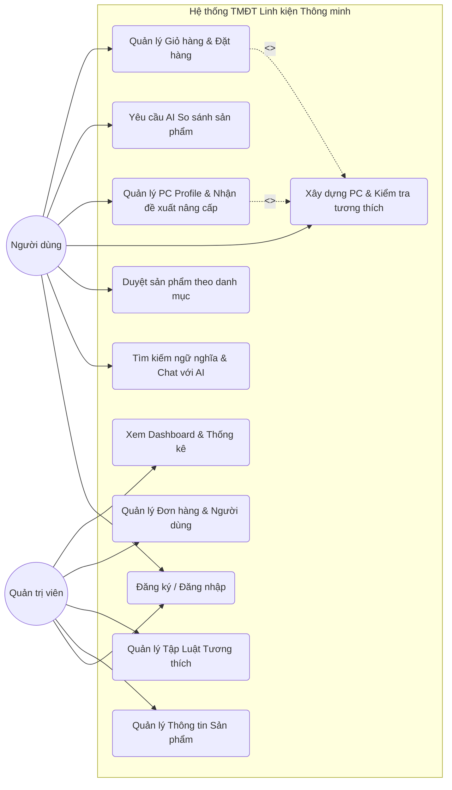
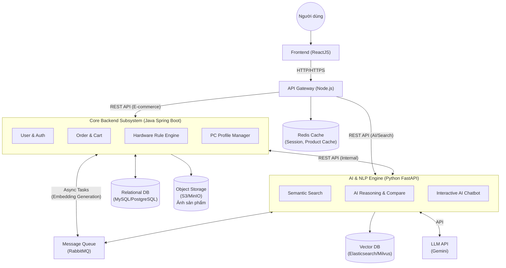
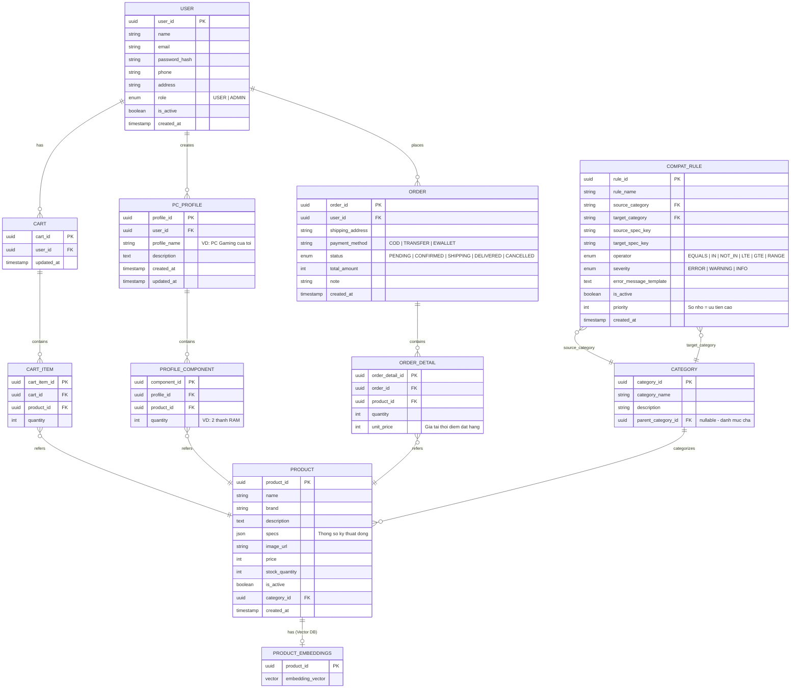
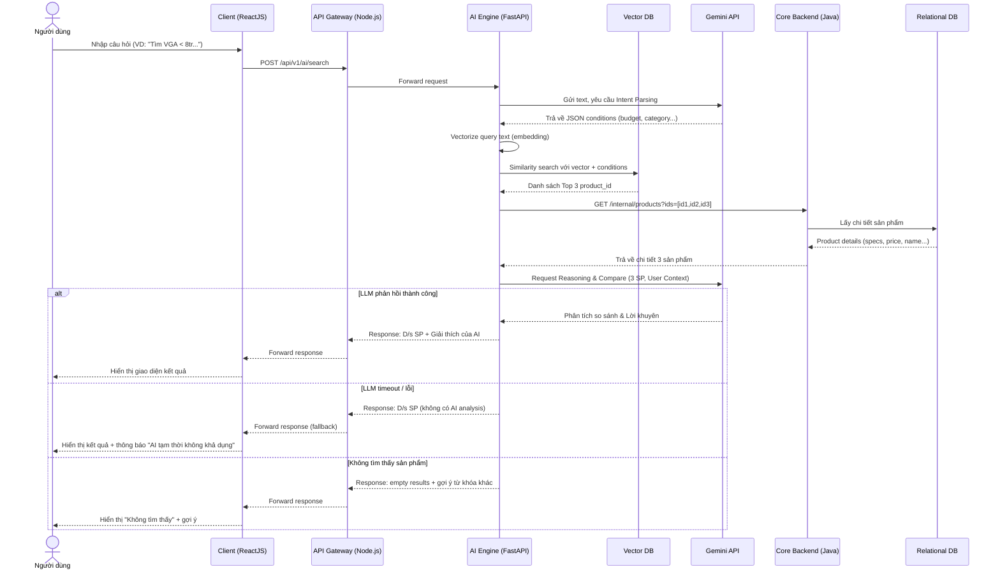
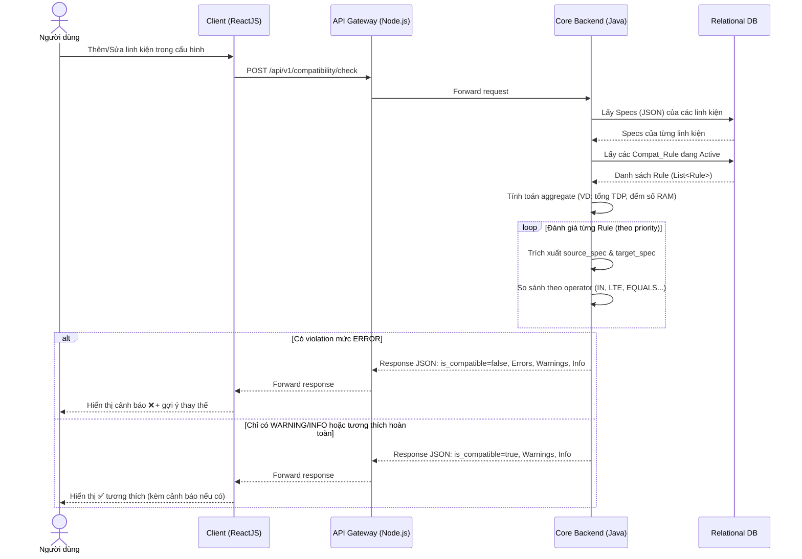

# TÀI LIỆU THIẾT KẾ DỰ ÁN: NỀN TẢNG THƯƠNG MẠI ĐIỆN TỬ LINH KIỆN ĐIỆN TỬ THÔNG MINH

## 1. Tổng quan dự án

**Sơ đồ Use-Case:**



**Mục tiêu:**
*   **Mục đích:** Xây dựng một nền tảng thương mại điện tử chuyên biệt phân phối linh kiện điện tử/máy tính. Giải quyết khó khăn lớn nhất của người dùng khi tự lắp ráp (build) hoặc nâng cấp máy tính: sự thiếu hụt kiến thức về tính tương thích phần cứng, khó khăn trong việc tìm đúng mã sản phẩm và không biết bắt đầu nâng cấp từ đâu.
*   **Phạm vi:** 
    *   Hệ thống quản lý bán hàng cơ bản (Quản lý người dùng, Sản phẩm, Giỏ hàng, Thanh toán, Đơn hàng).
    *   **Công cụ kiểm tra tính tương thích (Compatibility Checker):** Tự động phát hiện xung đột phần cứng.
    *   **Hồ sơ cấu hình (PC Profile) & Đề xuất nâng cấp:** Lưu trữ cấu hình hiện tại của người dùng, phân tích điểm nghẽn (bottleneck) và gợi ý lộ trình nâng cấp.
    *   **Tích hợp AI suy luận (LLM - ví dụ: Gemini) vào Tìm kiếm & So sánh:** Vượt ra ngoài việc tìm kiếm từ khóa hay chatbot thông thường, AI được sử dụng như một "chuyên gia phần cứng" có khả năng suy luận. AI giúp phân tích ngữ nghĩa truy vấn phức tạp của người dùng để tìm kiếm, tự động trích xuất thông số, đánh giá và so sánh ưu/nhược điểm của các linh kiện dựa trên nhu cầu cụ thể (ví dụ: render 3D vs. chơi game).
*   **Bối cảnh:** Nhu cầu tự tùy biến và nâng cấp thiết bị công nghệ ngày càng cao. Người dùng cần một hệ thống không chỉ để "mua" mà còn để "được tư vấn" như một chuyên gia phần cứng thực thụ.
*   **Tài liệu tham khảo:** Chuẩn tài liệu đặc tả yêu cầu phần mềm IEEE 830, tài liệu API tích hợp LLM (Gemini API / OpenAI API), tài liệu Elasticsearch.

## 2. Thiết kế kiến trúc phần mềm (High-Level Design)

**Sơ đồ Kiến trúc Hệ thống (System Architecture Diagram):**



**Mô hình kiến trúc:**
Dự án sử dụng mô hình **Client-Server** kết hợp với kiến trúc **Microservices** (dựa trên **Service-Oriented Architecture - SOA**). 
*   **Client (Frontend):** Ứng dụng Web (ReactJS)[cite: 1].
*   **API Gateway:** Điều hướng request và luân chuyển dữ liệu qua RESTful API (Node.js).
*   **Core Backend:** Hệ thống nghiệp vụ E-commerce cốt lõi (Java - Spring Boot). Xử lý dữ liệu cấu trúc chặt chẽ.
*   **AI Reasoning & NLP Engine (Microservices):** Trái tim thông minh của hệ thống (Python - FastAPI), giao tiếp trực tiếp với Vector Database và các mô hình ngôn ngữ lớn (LLM như Gemini) để thực hiện các tác vụ suy luận, so sánh và tìm kiếm ngữ nghĩa[cite: 1]. Giao tiếp với Core Backend qua RESTful API.

**Phân rã hệ thống (Modules):**
1.  **User & E-commerce Core Subsystem:** Quản lý tài khoản, danh mục, giỏ hàng, đơn hàng[cite: 1].
2.  **Hardware Profile & Rule Engine Subsystem:** Xử lý hồ sơ máy tính và kiểm tra tính tương thích dựa trên các luật cứng (Rule-based)[cite: 1].
3.  **Semantic Search Subsystem:** Khác với tìm kiếm truyền thống, module này kết hợp Elasticsearch (Fuzzy Search) và vector hóa dữ liệu (Vector Database) để tìm kiếm dựa trên "ý nghĩa" câu chữ[cite: 1].
4.  **AI Reasoning & Comparison Subsystem:** Nhận đầu vào là các sản phẩm hoặc yêu cầu mơ hồ, sử dụng LLM để[cite: 1]:
    *   Suy luận ra nhu cầu cấu hình thực tế (VD: "Máy làm đồ họa kiến trúc" -> Cần ưu tiên CPU đa nhân, RAM lớn, Card Nvidia)[cite: 1].
    *   So sánh 2 sản phẩm và tạo ra bảng tóm tắt ưu/nhược điểm theo ngữ cảnh của người dùng[cite: 1].
5.  **Interactive AI Chatbot:** Giao diện giao tiếp bằng ngôn ngữ tự nhiên, đóng vai trò luân chuyển dữ liệu từ người dùng đến các module AI phía trên và trả kết quả dưới dạng hội thoại[cite: 1].

## 3. Thiết kế dữ liệu (Database Design)

**Sơ đồ thực thể liên kết (ERD):**



**Mô tả các thực thể AI Context:**
*   Các bảng cơ bản vẫn giữ nguyên: `User`, `Order`, `Product`, `Category`, `PC_Profile`, `Compat_Rule`[cite: 1].
*   **Thêm thực thể cho AI:**
    *   `Product_Embeddings`: (1) Product - (1) Product_Embeddings (Chứa vector biểu diễn thông tin sản phẩm để phục vụ Semantic Search)[cite: 1].

**Từ điển dữ liệu bổ sung:**

| Tên bảng | Tên trường | Kiểu dữ liệu | Ràng buộc | Mô tả |
| :--- | :--- | :--- | :--- | :--- |
| **Product_Embeddings**[cite: 1]| `product_id`[cite: 1] | UUID[cite: 1] | Primary Key/FK[cite: 1] | Mã sản phẩm[cite: 1] |
| | `embedding_vector`[cite: 1] | VECTOR[cite: 1] | | Vector ngữ nghĩa của tên, mô tả và thông số kỹ thuật (dùng để query bằng độ tương tự cosine)[cite: 1] |
| **Compat_Rule** | `rule_id` | UUID | Primary Key | Mã định danh quy tắc tương thích |
| | `rule_name` | VARCHAR(255) | NOT NULL | Tên mô tả quy tắc (VD: "CPU-Motherboard Socket Match") |
| | `source_category` | VARCHAR(100) | NOT NULL, FK → Category | Loại linh kiện nguồn cần kiểm tra (VD: `CPU`) |
| | `target_category` | VARCHAR(100) | NOT NULL, FK → Category | Loại linh kiện đích để đối chiếu (VD: `Motherboard`) |
| | `source_spec_key` | VARCHAR(100) | NOT NULL | Key thông số kỹ thuật ở linh kiện nguồn (VD: `socket_type`) |
| | `target_spec_key` | VARCHAR(100) | NOT NULL | Key thông số kỹ thuật ở linh kiện đích (VD: `supported_sockets`) |
| | `operator` | ENUM('EQUALS', 'IN', 'NOT_IN', 'LTE', 'GTE', 'RANGE') | NOT NULL | Phép so sánh giữa source_spec và target_spec |
| | `severity` | ENUM('ERROR', 'WARNING', 'INFO') | NOT NULL | Mức độ nghiêm trọng: `ERROR` = chặn thêm giỏ hàng, `WARNING` = cảnh báo, `INFO` = gợi ý |
| | `error_message_template` | TEXT | NOT NULL | Template thông báo khi vi phạm, hỗ trợ placeholder `{source_value}`, `{target_value}` |
| | `is_active` | BOOLEAN | DEFAULT TRUE | Bật/tắt quy tắc mà không cần xóa |
| | `priority` | INT | DEFAULT 0 | Thứ tự ưu tiên đánh giá (số nhỏ = ưu tiên cao) |
| | `created_at` | TIMESTAMP | DEFAULT NOW() | Thời điểm tạo quy tắc |

*Quan hệ: `Compat_Rule.source_category` và `Compat_Rule.target_category` → FK tham chiếu đến `Category.category_name`. Mỗi quy tắc áp dụng lên một cặp loại linh kiện (VD: CPU ↔ Motherboard, RAM ↔ Motherboard, GPU ↔ Case). Thông số kỹ thuật (`source_spec_key`, `target_spec_key`) tham chiếu đến các key trong trường JSON specs của bảng `Product`.*

**Dữ liệu mẫu quy tắc tương thích (Compat_Rule Seed Data):**

| rule_name | source → target | source_spec_key | operator | target_spec_key | severity |
| :--- | :--- | :--- | :--- | :--- | :--- |
| CPU-Motherboard Socket Match | CPU → Motherboard | `socket_type` | IN | `supported_sockets` | ERROR |
| RAM Type Compatibility | RAM → Motherboard | `memory_type` | IN | `supported_memory_types` | ERROR |
| RAM Slot Count | RAM (count) → Motherboard | `_count` | LTE | `ram_slots` | ERROR |
| Max RAM Capacity | RAM (tổng) → Motherboard | `_sum_capacity_gb` | LTE | `max_ram_gb` | ERROR |
| GPU Length vs Case | GPU → Case | `length_mm` | LTE | `max_gpu_length_mm` | ERROR |
| CPU Cooler Socket Support | CPU → CPU_Cooler | `socket_type` | IN | `supported_sockets` | ERROR |
| PSU Wattage Sufficiency | _SYSTEM (tổng TDP) → PSU | `_total_tdp_w` | LTE | `rated_wattage_w` | WARNING |
| Mainboard Form Factor vs Case | Motherboard → Case | `form_factor` | IN | `supported_form_factors` | ERROR |
| M.2 Slot Count | SSD_M2 (count) → Motherboard | `_count` | LTE | `m2_slots` | WARNING |
| PCIe Generation | GPU → Motherboard | `pcie_gen` | LTE | `max_pcie_gen` | INFO |

> *Lưu ý thiết kế: Các `spec_key` bắt đầu bằng `_` (VD: `_count`, `_sum_capacity_gb`, `_total_tdp_w`) là các giá trị tính toán động (aggregate), được Rule Engine tính từ danh sách linh kiện trong PC Profile, không phải trường trực tiếp trong bảng Product.*

> *Lưu ý kiến trúc: Vector Database chứa bảng `Product_Embeddings` sẽ được thiết kế nằm chung mạng nội bộ (VPC) với Python AI Service. Quá trình Semantic Search sẽ được truy vấn nội bộ tại đây, sau đó Python Service chỉ trả về mảng danh sách `product_id` cho Java Core qua REST API để lấy thông tin chi tiết, nhằm tối ưu băng thông mạng.*

## 4. Thiết kế chi tiết (Low-Level Design / Internal Design)

**Sơ đồ tuần tự: Luồng Tìm kiếm ngữ nghĩa & Suy luận với LLM**



**Luồng xử lý (Data Flow): Luồng Tìm kiếm ngữ nghĩa & Suy luận với LLM**[cite: 1]
1.  **Input:** Người dùng nhập: *"Cần mua card màn hình dưới 8 triệu chạy mượt Cyberpunk 2077 và thỉnh thoảng edit video"*[cite: 1].
2.  **Intent Parsing (LLM):** Hệ thống gửi chuỗi này đến LLM (Gemini)[cite: 1]. AI suy luận và trích xuất ra các điều kiện: `{ "budget": <= 8000000, "category": "VGA", "keywords": ["gaming high-end", "video editing"], "brand_preference": "Nvidia (tốt cho edit video)" }`[cite: 1].
3.  **Database Query:** Hệ thống dùng JSON trên để query vào database hoặc Vector DB, lấy ra top 3 sản phẩm phù hợp nhất (VD: RTX 4060, RX 7600)[cite: 1].
4.  **AI Reasoning & Generation:** Gửi danh sách 3 sản phẩm này ngược lại cho LLM yêu cầu so sánh dựa trên ngữ cảnh người dùng[cite: 1].
5.  **Output:** Trả về kết quả hiển thị cho Frontend gồm: Danh sách sản phẩm + Đoạn giải thích suy luận của AI (VD: *"RTX 4060 được đề xuất vì hỗ trợ CUDA tốt cho việc edit video của bạn, dù RX 7600 có hiệu năng thuần chơi game tương đương..."*)[cite: 1].

**Đặc tả RESTful API cho module so sánh (Module Specification):**
*   **Endpoint:** `POST /api/v1/ai/compare` (Thuộc Python Microservice)
*   **Tên hàm nội bộ:** `generateAIComparison()`[cite: 1]
*   **Yêu cầu tích hợp:** Core Backend (Java) sẽ đóng gói payload dưới dạng Data Transfer Object (DTO) gửi sang service này.
*   **Đầu vào (Request Body JSON):** 
    `{ "product_A_id": "id_A", "product_B_id": "id_B", "user_context": "Dùng để lập trình AI" }`
*   **Xử lý:** Nhận request, fetch chi tiết `Product_Specs` của A và B[cite: 1]. Construct một prompt gửi đến LLM (Gemini API) với nội dung: *"Hãy đóng vai chuyên gia phần cứng. So sánh sản phẩm A [Specs A] và B [Specs B]. Dựa trên nhu cầu [user_context], hãy phân tích ưu/nhược và đưa ra lời khuyên"*[cite: 1].
*   **Kết quả trả về (Response JSON):** 
```json
{
  "comparison_summary": "Sản phẩm A có lợi thế về VRAM lớn, rất phù hợp cho lập trình AI so với B...",
  "winner_id": "id_A",
  "key_differences": [
    {"feature": "VRAM", "A": "16GB", "B": "8GB"},
    {"feature": "Core Clock", "A": "2.2 GHz", "B": "2.5 GHz"}
  ]
}
```

---

**Sơ đồ tuần tự: Luồng Kiểm tra tính tương thích phần cứng (Compatibility Check)**



**Luồng xử lý (Data Flow): Luồng Kiểm tra tính tương thích phần cứng (Compatibility Check)**
1.  **Input:** Người dùng thêm linh kiện vào giỏ hàng hoặc vào PC Profile Builder (VD: chọn CPU Intel i7-13700K khi đã có Mainboard ASUS ROG X670E socket AM5).
2.  **Fetch Specs:** Core Backend (Java) truy vấn bảng `Product` để lấy thông số kỹ thuật (JSON specs) của tất cả linh kiện hiện có trong cấu hình.
3.  **Load Rules:** Rule Engine tải toàn bộ quy tắc `is_active = TRUE` từ bảng `Compat_Rule`, lọc theo các cặp `source_category` ↔ `target_category` có mặt trong cấu hình.
4.  **Evaluate:** Với mỗi quy tắc, engine trích xuất giá trị `source_spec_key` và `target_spec_key` từ specs của linh kiện tương ứng, sau đó thực hiện phép so sánh theo `operator`:
    *   `EQUALS`: source_value == target_value
    *   `IN`: source_value nằm trong danh sách target_value
    *   `LTE` / `GTE`: source_value <= / >= target_value (dùng cho số)
    *   Với các aggregate key (bắt đầu bằng `_`): tính toán từ tập linh kiện (VD: đếm số thanh RAM, tổng dung lượng RAM, tổng TDP).
5.  **Output:** Trả về danh sách vi phạm (violations) kèm severity. Nếu có bất kỳ violation nào ở mức `ERROR`, hệ thống hiển thị cảnh báo và có thể chặn thêm vào giỏ hàng.

**Đặc tả RESTful API cho module kiểm tra tương thích (Module Specification):**
*   **Endpoint:** `POST /api/v1/compatibility/check` (Thuộc Core Backend - Java Spring Boot)
*   **Tên hàm nội bộ:** `checkCompatibility()`
*   **Mô tả:** Nhận danh sách ID sản phẩm, đánh giá tính tương thích dựa trên các quy tắc trong bảng `Compat_Rule`, trả về kết quả chi tiết.
*   **Đầu vào (Request Body JSON):**
    `{ "product_ids": ["uuid-cpu", "uuid-mainboard", "uuid-ram-1", "uuid-ram-2", "uuid-gpu", "uuid-psu", "uuid-case"] }`
*   **Xử lý:** Nhận request → Fetch `Product` specs cho từng ID → Load `Compat_Rule` (active) → Tính aggregate values → Evaluate từng rule → Tập hợp violations theo severity.
*   **Kết quả trả về (Response JSON):**
```json
{
  "is_compatible": false,
  "errors": [
    {
      "rule_name": "CPU-Motherboard Socket Match",
      "severity": "ERROR",
      "message": "CPU socket LGA1700 không tương thích với Mainboard (hỗ trợ: AM5)",
      "source_product": { "id": "uuid-cpu", "name": "Intel Core i7-13700K" },
      "target_product": { "id": "uuid-mainboard", "name": "ASUS ROG X670E" }
    }
  ],
  "warnings": [
    {
      "rule_name": "PSU Wattage Sufficiency",
      "severity": "WARNING",
      "message": "Tổng TDP hệ thống (380W) đang gần ngưỡng 80% công suất PSU (500W). Khuyến nghị nâng cấp nguồn.",
      "source_product": null,
      "target_product": { "id": "uuid-psu", "name": "Corsair CV550" }
    }
  ],
  "info": []
}
```

## 5. Thiết kế giao diện người dùng (UI/UX)

### 5.1. Sơ đồ di chuyển màn hình (Screen Navigation Flow)

Luồng thao tác chính của người dùng giữa các màn hình:
```mermaid
flowchart TD
    Login[Đăng nhập / Đăng ký\n(Login / Register)]
    Home[Trang chủ\n(Home)]
    Search[Tìm kiếm\n(Search)]
    Category[Danh mục\n(Category)]
    Builder[PC Builder\n(Compat Checker)]
    Profile[PC Profile\n(Cấu hình của tôi)]
    Account[Tài khoản\n(Account / Order History)]
    Detail[Chi tiết SP\n(Product Detail)]
    Compare[So sánh SP\n(AI Compare)]
    Cart[Giỏ hàng\n(Cart)]
    CompatResult[Kết quả Tương thích\n(Compat Result)]
    UpgradeSuggest[Đề xuất Nâng cấp\n(Upgrade Suggest)]
    Checkout[Thanh toán\n(Checkout)]
    OrderConfirm[Xác nhận Đơn hàng\n(Order Confirm)]

    Login --> Home
    Home --> Search
    Home --> Category
    Home --> Builder
    Home --> Profile
    Home --> Account

    Search --> Detail
    Category --> Detail
    Builder --> Detail

    Detail --> Compare
    Detail --> Cart
    Compare --> Cart
    Builder --> CompatResult
    Profile --> UpgradeSuggest
    UpgradeSuggest --> Detail

    Cart --> Checkout
    Checkout --> OrderConfirm

    subgraph Admin_Panel ["Khu vực Quản trị (Admin)"]
        AdminDashboard[Dashboard\n(Thống kê)]
        AdminProducts[Quản lý Sản phẩm\n(Products)]
        AdminOrders[Quản lý Đơn hàng\n(Orders)]
        AdminRules[Quản lý Luật tương thích\n(Compat Rules)]
        AdminUsers[Quản lý Người dùng\n(Users)]
        AdminDashboard --> AdminProducts
        AdminDashboard --> AdminOrders
        AdminDashboard --> AdminRules
        AdminDashboard --> AdminUsers
    end

    Login -->|Admin| AdminDashboard
```

**Mô tả các luồng di chuyển chính:**

| STT | Luồng | Mô tả |
| :--- | :--- | :--- |
| 1 | Đăng nhập → Trang chủ → Tìm kiếm → Chi tiết SP → Giỏ hàng → Thanh toán → Xác nhận | Luồng mua hàng cơ bản |
| 2 | Trang chủ → Danh mục → Chi tiết SP | Duyệt sản phẩm theo danh mục |
| 3 | Chi tiết SP → So sánh SP → Giỏ hàng | Chọn 2 sản phẩm để AI so sánh, sau đó mua SP được đề xuất |
| 4 | Trang chủ → PC Builder → Chọn linh kiện → Kết quả Tương thích | Xây dựng cấu hình và kiểm tra tương thích real-time |
| 5 | PC Builder → Chi tiết SP → Giỏ hàng | Từ builder, xem chi tiết rồi thêm cả bộ vào giỏ |
| 6 | Trang chủ → PC Profile → Đề xuất Nâng cấp → Chi tiết SP → Giỏ hàng | Xem cấu hình, nhận gợi ý nâng cấp, xem chi tiết và mua |
| 7 | Trang chủ → Tài khoản | Xem lịch sử đơn hàng, chỉnh sửa thông tin cá nhân |
| 8 | Đăng nhập (Admin) → Dashboard → Quản lý SP / Đơn hàng / Luật / Người dùng | Luồng quản trị hệ thống |

### 5.2. Bản vẽ giao diện (Layout / Mockup)

#### Màn hình 0: Đăng nhập / Đăng ký (Login / Register)

```
┌──────────────────────────────────────────────────────────────────┐
│  [Logo]              NỀN TẢNG LINH KIỆN ĐIỆN TỬ THÔNG MINH     │
├──────────────────────────────────────────────────────────────────┤
│                                                                  │
│              ┌──────────────────────────────────┐                │
│              │  [Đăng nhập]  |  Đăng ký          │                │
│              ├──────────────────────────────────┤                │
│              │                                  │                │
│              │  📧 Email                        │                │
│              │  ┌──────────────────────────┐    │                │
│              │  │ user@example.com         │    │                │
│              │  └──────────────────────────┘    │                │
│              │                                  │                │
│              │  🔒 Mật khẩu                     │                │
│              │  ┌──────────────────────────┐    │                │
│              │  │ ••••••••••••             │    │                │
│              │  └──────────────────────────┘    │                │
│              │                                  │                │
│              │  ☐ Ghi nhớ đăng nhập             │                │
│              │                                  │                │
│              │  ┌──────────────────────────┐    │                │
│              │  │     🔓 ĐĂNG NHẬP         │    │                │
│              │  └──────────────────────────┘    │                │
│              │                                  │                │
│              │  ── Hoặc đăng nhập bằng ──────  │                │
│              │  [Google]    [Facebook]           │                │
│              │                                  │                │
│              │  Quên mật khẩu?                  │                │
│              └──────────────────────────────────┘                │
│                                                                  │
├──────────────────────────────────────────────────────────────────┤
│  Footer: Về chúng tôi | Chính sách | Liên hệ | © 2025          │
└──────────────────────────────────────────────────────────────────┘
```

*Khi chọn tab "Đăng ký", form bổ sung thêm: Họ tên, Số điện thoại, Xác nhận mật khẩu.*

#### Màn hình 1: Trang chủ (Home)

```
┌──────────────────────────────────────────────────────────────────┐
│  [Logo]          [Tìm kiếm AI _______________🔍]    [🛒] [👤]  │
│  Trang chủ | Danh mục ▼ | PC Builder | PC Profile              │
├──────────────────────────────────────────────────────────────────┤
│                                                                  │
│  ┌────────────────────────────────────────────────────────────┐  │
│  │              🖥️  BANNER KHUYẾN MÃI / COMBO HOT            │  │
│  │         "Build PC Gaming từ 15 triệu - Tặng tản nhiệt"   │  │
│  │                    [Xem ngay →]                            │  │
│  └────────────────────────────────────────────────────────────┘  │
│                                                                  │
│  ── Danh mục nổi bật ──────────────────────────────────────────  │
│  ┌────────┐ ┌────────┐ ┌────────┐ ┌────────┐ ┌────────┐        │
│  │  CPU   │ │  GPU   │ │  RAM   │ │  SSD   │ │Mainboard│       │
│  │  🔲    │ │  🔲    │ │  🔲    │ │  🔲    │ │  🔲     │       │
│  └────────┘ └────────┘ └────────┘ └────────┘ └────────┘        │
│                                                                  │
│  ── Sản phẩm bán chạy ────────────────────────────────────────  │
│  ┌──────────┐ ┌──────────┐ ┌──────────┐ ┌──────────┐           │
│  │ [Ảnh SP] │ │ [Ảnh SP] │ │ [Ảnh SP] │ │ [Ảnh SP] │           │
│  │ Tên SP   │ │ Tên SP   │ │ Tên SP   │ │ Tên SP   │           │
│  │ ⭐⭐⭐⭐  │ │ ⭐⭐⭐⭐⭐│ │ ⭐⭐⭐⭐  │ │ ⭐⭐⭐⭐⭐│           │
│  │ 3.990.000│ │ 8.490.000│ │ 1.290.000│ │ 5.690.000│           │
│  │[Thêm 🛒]│ │[Thêm 🛒]│ │[Thêm 🛒]│ │[Thêm 🛒]│           │
│  └──────────┘ └──────────┘ └──────────┘ └──────────┘           │
│                                                                  │
│  ── 💬 Hỏi chuyên gia AI ─────────────────────────────────────  │
│  ┌────────────────────────────────────────────────────────────┐  │
│  │  "Bạn cần tư vấn gì? VD: Máy chơi game 20 triệu..."     │  │
│  │  [____________________________________] [Gửi]             │  │
│  └────────────────────────────────────────────────────────────┘  │
│                                                                  │
├──────────────────────────────────────────────────────────────────┤
│  Footer: Về chúng tôi | Chính sách | Liên hệ | © 2025          │
└──────────────────────────────────────────────────────────────────┘
```

#### Màn hình 2: Tìm kiếm thông minh (AI Search)

```
┌──────────────────────────────────────────────────────────────────┐
│  [Logo]     [Card đồ họa chơi game tầm 8 triệu 🔍]  [🛒] [👤] │
├──────────────────────────────────────────────────────────────────┤
│                                                                  │
│  🤖 AI hiểu: "VGA gaming, budget ≤ 8tr, ưu tiên Nvidia"        │
│  ┌────────────────────────────────────────────────────────────┐  │
│  │ 💡 AI gợi ý: Với nhu cầu chơi game, bạn nên ưu tiên GPU  │  │
│  │ có VRAM ≥ 8GB. Nvidia RTX 40xx hỗ trợ DLSS 3 tốt cho     │  │
│  │ gaming. Nếu thỉnh thoảng edit video, CUDA cores sẽ hữu ích│ │
│  └────────────────────────────────────────────────────────────┘  │
│                                                                  │
│  Bộ lọc: [Hãng ▼] [Giá ▼] [VRAM ▼] [Còn hàng ☑]              │
│                                                                  │
│  ── Kết quả (12 sản phẩm) ─── Sắp xếp: [Phù hợp nhất ▼] ──── │
│                                                                  │
│  ┌──────────────────────────────────────────────────────────┐   │
│  │ [Ảnh]  RTX 4060 8GB GDDR6                    7.990.000đ │   │
│  │        ⭐⭐⭐⭐⭐ (234)  │ VRAM: 8GB │ TDP: 115W          │   │
│  │        🤖 "Phù hợp 95% nhu cầu của bạn"                 │   │
│  │        [So sánh ☐]  [Thêm vào 🛒]  [Xem chi tiết →]    │   │
│  └──────────────────────────────────────────────────────────┘   │
│  ┌──────────────────────────────────────────────────────────┐   │
│  │ [Ảnh]  RX 7600 8GB GDDR6                     6.490.000đ │   │
│  │        ⭐⭐⭐⭐ (187)   │ VRAM: 8GB │ TDP: 165W           │   │
│  │        🤖 "Giá tốt hơn, hiệu năng gaming tương đương"    │   │
│  │        [So sánh ☐]  [Thêm vào 🛒]  [Xem chi tiết →]    │   │
│  └──────────────────────────────────────────────────────────┘   │
│                                                                  │
│  [So sánh 2 SP đã chọn]                                        │
│                                                                  │
└──────────────────────────────────────────────────────────────────┘
```

**Trạng thái Loading (khi AI đang xử lý, ~2-5 giây):**
```
┌──────────────────────────────────────────────────────────────────┐
│  [Logo]     [Card đồ họa chơi game tầm 8 triệu 🔍]  [🛒] [👤] │
├──────────────────────────────────────────────────────────────────┤
│                                                                  │
│  🤖 AI đang phân tích yêu cầu của bạn...                        │
│  ┌────────────────────────────────────────────────────────────┐  │
│  │  ░░░░░░░░░░░░░░░░░░░░░░░░░░░  (Skeleton loading)         │  │
│  │  ░░░░░░░░░░░░░░░░░░░░                                    │  │
│  └────────────────────────────────────────────────────────────┘  │
│                                                                  │
│  ── Kết quả đang tải ─────────────────────────────────────────  │
│  ┌──────────────────────────────────────────────────────────┐   │
│  │  ░░░░░░  ░░░░░░░░░░░░░░░░░░░░░░░░  (Skeleton card)     │   │
│  │          ░░░░░░░░░░░░░░░                                 │   │
│  │          ░░░░░░░░                                        │   │
│  └──────────────────────────────────────────────────────────┘   │
│  ┌──────────────────────────────────────────────────────────┐   │
│  │  ░░░░░░  ░░░░░░░░░░░░░░░░░░░░░░░░  (Skeleton card)     │   │
│  │          ░░░░░░░░░░░░░░░                                 │   │
│  │          ░░░░░░░░                                        │   │
│  └──────────────────────────────────────────────────────────┘   │
└──────────────────────────────────────────────────────────────────┘
```

**Trạng thái Lỗi (khi AI không khả dụng):**
```
┌──────────────────────────────────────────────────────────────────┐
│  [Logo]     [Card đồ họa chơi game tầm 8 triệu 🔍]  [🛒] [👤] │
├──────────────────────────────────────────────────────────────────┤
│                                                                  │
│  ┌────────────────────────────────────────────────────────────┐  │
│  │  ⚠️ AI tạm thời không khả dụng. Hiển thị kết quả tìm     │  │
│  │  kiếm thông thường (theo từ khóa).  [Thử lại 🔄]         │  │
│  └────────────────────────────────────────────────────────────┘  │
│                                                                  │
│  Bộ lọc: [Hãng ▼] [Giá ▼] [VRAM ▼] [Còn hàng ☑]              │
│                                                                  │
│  ── Kết quả (8 sản phẩm) ─── Sắp xếp: [Giá thấp → cao ▼] ──  │
│  ┌──────────────────────────────────────────────────────────┐   │
│  │ [Ảnh]  RTX 4060 8GB GDDR6                    7.990.000đ │   │
│  │        ⭐⭐⭐⭐⭐ (234)  │ VRAM: 8GB │ TDP: 115W          │   │
│  │        [So sánh ☐]  [Thêm vào 🛒]  [Xem chi tiết →]    │   │
│  └──────────────────────────────────────────────────────────┘   │
└──────────────────────────────────────────────────────────────────┘
```

#### Màn hình 3: Chi tiết sản phẩm (Product Detail)

```
┌──────────────────────────────────────────────────────────────────┐
│  [Logo]          [Tìm kiếm AI _______________🔍]    [🛒] [👤]  │
│  Trang chủ > GPU > NVIDIA > RTX 4060                            │
├──────────────────────────────────────────────────────────────────┤
│                                                                  │
│  ┌──────────────────┐  ┌──────────────────────────────────────┐ │
│  │                  │  │  NVIDIA GeForce RTX 4060 8GB GDDR6  │ │
│  │                  │  │  ⭐⭐⭐⭐⭐ (234 đánh giá)              │ │
│  │   [Ảnh sản phẩm] │  │                                      │ │
│  │    (gallery)     │  │  Giá: 7.990.000đ                    │ │
│  │                  │  │  Tình trạng: ✅ Còn hàng             │ │
│  │  [1] [2] [3] [4] │  │                                      │ │
│  │                  │  │  [Thêm vào giỏ hàng 🛒]             │ │
│  │                  │  │  [Thêm vào PC Builder 🔧]            │ │
│  │                  │  │  [So sánh với SP khác ⚖️]            │ │
│  └──────────────────┘  └──────────────────────────────────────┘ │
│                                                                  │
│  ── Thông số kỹ thuật ─────────────────────────────────────────  │
│  ┌──────────────────────────────────────────────────────────┐   │
│  │  GPU Engine      │  Ada Lovelace                         │   │
│  │  CUDA Cores      │  3072                                 │   │
│  │  VRAM            │  8GB GDDR6                            │   │
│  │  Memory Bus      │  128-bit                              │   │
│  │  Base Clock      │  1830 MHz                             │   │
│  │  Boost Clock     │  2460 MHz                             │   │
│  │  TDP             │  115W                                 │   │
│  │  Chiều dài       │  240mm                                │   │
│  │  PCIe            │  4.0 x8                               │   │
│  │  Nguồn yêu cầu  │  ≥ 550W                               │   │
│  └──────────────────────────────────────────────────────────┘   │
│                                                                  │
│  ── ⚠️ Tương thích với cấu hình của bạn ──────────────────────  │
│  ┌──────────────────────────────────────────────────────────┐   │
│  │  ✅ PCIe: Tương thích mainboard (PCIe 4.0)              │   │
│  │  ✅ Kích thước: Vừa case (240mm < 350mm max)            │   │
│  │  ⚠️ Nguồn: PSU hiện tại 500W, khuyến nghị ≥ 550W       │   │
│  │        [Xem PSU phù hợp →]                              │   │
│  └──────────────────────────────────────────────────────────┘   │
│                                                                  │
└──────────────────────────────────────────────────────────────────┘
```

#### Màn hình 4: PC Builder & Compatibility Checker

```
┌──────────────────────────────────────────────────────────────────┐
│  [Logo]          [Tìm kiếm AI _______________🔍]    [🛒] [👤]  │
│  Trang chủ > PC Builder                                         │
├──────────────────────────────────────────────────────────────────┤
│                                                                  │
│  🔧 XÂY DỰNG CẤU HÌNH MÁY TÍNH          Tổng: 25.460.000đ    │
│                                                                  │
│  ┌──────────────────────────────────────────────────────────┐   │
│  │ Linh kiện     │ Sản phẩm đã chọn        │ Giá     │Thao tác│   │
│  │───────────────┼──────────────────────────┼─────────┼────│   │
│  │ 🔲 CPU        │ Intel i7-13700K          │7.990.000│ ✏️❌│   │
│  │ 🔲 Mainboard  │ ⚠️ ASUS ROG X670E (AM5) │5.490.000│ ✏️❌│   │
│  │ 🔲 RAM        │ Corsair 16GB DDR5 x2     │2.980.000│ ✏️❌│   │
│  │ 🔲 GPU        │ RTX 4060 8GB             │7.990.000│ ✏️❌│   │
│  │ 🔲 SSD        │ Samsung 990 Pro 1TB      │3.290.000│ ✏️❌│   │
│  │ 🔲 PSU        │ [+ Chọn nguồn]           │    —    │    │   │
│  │ 🔲 Case       │ [+ Chọn vỏ case]         │    —    │    │   │
│  │ 🔲 Tản nhiệt  │ [+ Chọn tản nhiệt]       │    —    │    │   │
│  └──────────────────────────────────────────────────────────┘   │
│                                                                  │
│  ── 🔍 Kết quả kiểm tra tương thích ──────────────────────────  │
│  ┌──────────────────────────────────────────────────────────┐   │
│  │  ❌ LỖI: CPU socket LGA1700 không tương thích với        │   │
│  │     Mainboard ASUS ROG X670E (socket AM5).               │   │
│  │     → Gợi ý: [ASUS ROG Z790] [MSI MAG B760M]            │   │
│  │                                                           │   │
│  │  ⚠️ CẢNH BÁO: Chưa chọn PSU. Tổng TDP ước tính: 280W.  │   │
│  │     → Khuyến nghị PSU ≥ 450W.                            │   │
│  │                                                           │   │
│  │  ✅ RAM DDR5 tương thích với Mainboard.                   │   │
│  │  ✅ SSD M.2 tương thích (còn 1 slot M.2 trống).          │   │
│  └──────────────────────────────────────────────────────────┘   │
│                                                                  │
│  [Thêm tất cả vào giỏ hàng 🛒]    [Lưu cấu hình 💾]          │
│                                                                  │
└──────────────────────────────────────────────────────────────────┘
```

#### Màn hình 5: So sánh sản phẩm bằng AI (AI Compare)

```
┌──────────────────────────────────────────────────────────────────┐
│  [Logo]          [Tìm kiếm AI _______________🔍]    [🛒] [👤]  │
│  Trang chủ > So sánh sản phẩm                                   │
├──────────────────────────────────────────────────────────────────┤
│                                                                  │
│  Nhu cầu của bạn: [Chơi game và edit video thỉnh thoảng  ✏️]   │
│                                                                  │
│  ┌──────────────────────┬───┬──────────────────────┐            │
│  │   RTX 4060 8GB       │VS │   RX 7600 8GB        │            │
│  │   [Ảnh]              │   │   [Ảnh]              │            │
│  │   7.990.000đ         │   │   6.490.000đ         │            │
│  ├──────────────────────┼───┼──────────────────────┤            │
│  │ VRAM: 8GB GDDR6      │   │ VRAM: 8GB GDDR6     │            │
│  │ CUDA: 3072           │   │ Stream: 2048         │            │
│  │ TDP: 115W        ✅  │   │ TDP: 165W            │            │
│  │ Clock: 2460 MHz      │   │ Clock: 2655 MHz  ✅  │            │
│  │ DLSS 3.0         ✅  │   │ FSR 3.0              │            │
│  │ Encode: NVENC    ✅  │   │ Encode: VCE          │            │
│  └──────────────────────┴───┴──────────────────────┘            │
│                                                                  │
│  ── 🤖 Phân tích của AI ──────────────────────────────────────  │
│  ┌──────────────────────────────────────────────────────────┐   │
│  │  🏆 Đề xuất: RTX 4060                                    │   │
│  │                                                           │   │
│  │  "Với nhu cầu chơi game + edit video, RTX 4060 là lựa    │   │
│  │  chọn tốt hơn vì: (1) NVENC encoder vượt trội cho xuất  │   │
│  │  video, (2) CUDA cores hỗ trợ tốt các phần mềm Adobe,   │   │
│  │  (3) TDP 115W tiết kiệm điện hơn. RX 7600 có lợi thế    │   │
│  │  về giá rẻ hơn 1.5 triệu và xung nhịp cao hơn, phù     │   │
│  │  hợp nếu bạn chỉ chơi game thuần túy."                   │   │
│  └──────────────────────────────────────────────────────────┘   │
│                                                                  │
│  [Thêm RTX 4060 vào 🛒]        [Thêm RX 7600 vào 🛒]         │
│                                                                  │
└──────────────────────────────────────────────────────────────────┘
```

#### Màn hình 6: Giỏ hàng & Thanh toán (Cart & Checkout)

```
┌──────────────────────────────────────────────────────────────────┐
│  [Logo]          [Tìm kiếm AI _______________🔍]    [🛒3] [👤] │
│  Trang chủ > Giỏ hàng                                           │
├──────────────────────────────────────────────────────────────────┤
│                                                                  │
│  ┌──────────────────────────────────────────────────────────┐   │
│  │ [Ảnh] RTX 4060 8GB           SL: [- 1 +]    7.990.000đ │   │
│  │ [Ảnh] Intel i7-13700K        SL: [- 1 +]    7.990.000đ │   │
│  │ [Ảnh] Corsair DDR5 16GB x2   SL: [- 1 +]    2.980.000đ │   │
│  └──────────────────────────────────────────────────────────┘   │
│                                                                  │
│  ── ⚠️ Kiểm tra tương thích giỏ hàng ─────────────────────────  │
│  ┌──────────────────────────────────────────────────────────┐   │
│  │  ⚠️ Giỏ hàng chưa có Mainboard. Không thể kiểm tra      │   │
│  │     tương thích socket CPU và RAM.                        │   │
│  │     [Gợi ý mainboard phù hợp →]                         │   │
│  └──────────────────────────────────────────────────────────┘   │
│                                                                  │
│  ┌────────────────────────────────┐                             │
│  │  Tạm tính:        18.960.000đ │                             │
│  │  Phí vận chuyển:      30.000đ │                             │
│  │  ─────────────────────────── │                             │
│  │  Tổng cộng:       18.990.000đ │                             │
│  │                                │                             │
│  │  [Tiến hành thanh toán →]     │                             │
│  └────────────────────────────────┘                             │
│                                                                  │
└──────────────────────────────────────────────────────────────────┘
```

#### Màn hình 6b: Thanh toán (Checkout)

```
┌──────────────────────────────────────────────────────────────────┐
│  [Logo]          [Tìm kiếm AI _______________🔍]    [🛒3] [👤] │
│  Trang chủ > Giỏ hàng > Thanh toán                              │
├──────────────────────────────────────────────────────────────────┤
│                                                                  │
│  ── 📦 Thông tin giao hàng ───────────────────────────────────  │
│  ┌──────────────────────────────────────────────────────────┐   │
│  │  Họ tên:    [Nguyễn Văn A_________________________]     │   │
│  │  SĐT:      [0912345678___________________________]     │   │
│  │  Địa chỉ:  [123 Đường ABC, Quận 1, TP.HCM_______]     │   │
│  │  Ghi chú:  [Giao giờ hành chính_________________]      │   │
│  └──────────────────────────────────────────────────────────┘   │
│                                                                  │
│  ── 💳 Phương thức thanh toán ────────────────────────────────  │
│  ┌──────────────────────────────────────────────────────────┐   │
│  │  ● Thanh toán khi nhận hàng (COD)                       │   │
│  │  ○ Chuyển khoản ngân hàng                               │   │
│  │  ○ Ví điện tử (MoMo / ZaloPay / VNPay)                 │   │
│  └──────────────────────────────────────────────────────────┘   │
│                                                                  │
│  ── 🧾 Tóm tắt đơn hàng ─────────────────────────────────────  │
│  ┌──────────────────────────────────────────────────────────┐   │
│  │  RTX 4060 8GB            x1          7.990.000đ         │   │
│  │  Intel i7-13700K         x1          7.990.000đ         │   │
│  │  Corsair DDR5 16GB       x2          2.980.000đ         │   │
│  │  ──────────────────────────────────────────────          │   │
│  │  Tạm tính:                          18.960.000đ         │   │
│  │  Phí vận chuyển:                        30.000đ         │   │
│  │  Tổng cộng:                         18.990.000đ         │   │
│  └──────────────────────────────────────────────────────────┘   │
│                                                                  │
│  [← Quay lại giỏ hàng]            [Đặt hàng ✅]               │
│                                                                  │
└──────────────────────────────────────────────────────────────────┘
```

#### Màn hình 6c: Xác nhận đơn hàng (Order Confirmation)

```
┌──────────────────────────────────────────────────────────────────┐
│  [Logo]          [Tìm kiếm AI _______________🔍]    [🛒] [👤]  │
│  Trang chủ > Xác nhận đơn hàng                                  │
├──────────────────────────────────────────────────────────────────┤
│                                                                  │
│              ┌──────────────────────────────────┐                │
│              │                                  │                │
│              │         ✅ ĐẶT HÀNG THÀNH CÔNG   │                │
│              │                                  │                │
│              │  Mã đơn hàng: #ORD-20250919-001  │                │
│              │  Ngày đặt: 19/09/2025            │                │
│              │  Tổng: 18.990.000đ               │                │
│              │  Thanh toán: COD                  │                │
│              │  Trạng thái: ⏳ Đang xử lý       │                │
│              │                                  │                │
│              │  Dự kiến giao: 21-23/09/2025     │                │
│              │                                  │                │
│              └──────────────────────────────────┘                │
│                                                                  │
│  ┌──────────────────────────────────────────────────────────┐   │
│  │  📋 Chi tiết đơn hàng:                                   │   │
│  │  RTX 4060 8GB            x1          7.990.000đ          │   │
│  │  Intel i7-13700K         x1          7.990.000đ          │   │
│  │  Corsair DDR5 16GB       x2          2.980.000đ          │   │
│  │                                                           │   │
│  │  📦 Giao đến: 123 Đường ABC, Quận 1, TP.HCM             │   │
│  │  📞 SĐT: 0912345678                                      │   │
│  └──────────────────────────────────────────────────────────┘   │
│                                                                  │
│  [Tiếp tục mua sắm 🏠]        [Xem đơn hàng của tôi 📦]      │
│                                                                  │
└──────────────────────────────────────────────────────────────────┘
```

#### Màn hình 7: PC Profile & Đề xuất nâng cấp (Upgrade Suggestion)

```
┌──────────────────────────────────────────────────────────────────┐
│  [Logo]          [Tìm kiếm AI _______________🔍]    [🛒] [👤]  │
│  Trang chủ > PC Profile > "PC Gaming của tôi"                   │
├──────────────────────────────────────────────────────────────────┤
│                                                                  │
│  📋 CẤU HÌNH HIỆN TẠI: "PC Gaming của tôi"      [✏️ Sửa]      │
│                                                                  │
│  ┌──────────────────────────────────────────────────────────┐   │
│  │  CPU:       Intel i5-12400F          │ ⬛⬛⬛⬛⬛⬜⬜⬜ 62% │   │
│  │  GPU:       GTX 1660 Super 6GB       │ ⬛⬛⬛⬛⬜⬜⬜⬜ 50% │   │
│  │  RAM:       16GB DDR4 3200MHz        │ ⬛⬛⬛⬛⬛⬛⬜⬜ 75% │   │
│  │  SSD:       WD SN570 500GB           │ ⬛⬛⬛⬛⬛⬜⬜⬜ 60% │   │
│  │  Mainboard: MSI B660M-A DDR4         │                    │   │
│  │  PSU:       Corsair CV550 (550W)     │                    │   │
│  └──────────────────────────────────────────────────────────┘   │
│                                                                  │
│  ── 🤖 Phân tích điểm nghẽn (Bottleneck Analysis) ────────────  │
│  ┌──────────────────────────────────────────────────────────┐   │
│  │  🔴 Điểm nghẽn chính: GPU (GTX 1660 Super)               │   │
│  │  "GPU đang là thành phần yếu nhất. CPU i5-12400F có      │   │
│  │  hiệu năng đủ mạnh, nhưng GPU không tận dụng hết.        │   │
│  │  Nâng cấp GPU sẽ cải thiện hiệu năng gaming rõ rệt nhất."│   │
│  └──────────────────────────────────────────────────────────┘   │
│                                                                  │
│  ── 📈 Lộ trình nâng cấp đề xuất ─────────────────────────────  │
│  ┌──────────────────────────────────────────────────────────┐   │
│  │  Ưu tiên 1: GPU → RTX 4060 (7.990.000đ)  [Xem SP →]    │   │
│  │      ✅ Tương thích PSU 550W │ ✅ Tương thích PCIe 4.0   │   │
│  │                                                           │   │
│  │  Ưu tiên 2: SSD → Samsung 990 Pro 1TB (3.290.000đ)      │   │
│  │      ✅ Tương thích M.2 slot  │ Nâng dung lượng + tốc độ │   │
│  │                                                           │   │
│  │  Ưu tiên 3: RAM → 32GB DDR4 3600MHz (2.490.000đ)        │   │
│  │      ✅ Tương thích mainboard │ Nâng đa nhiệm            │   │
│  └──────────────────────────────────────────────────────────┘   │
│                                                                  │
│  [Thêm tất cả đề xuất vào 🛒]     [Xuất PDF cấu hình 📄]     │
│                                                                  │
└──────────────────────────────────────────────────────────────────┘
```

> *Ghi chú: Thanh hiệu năng (%) trong PC Profile được tính dựa trên **xếp hạng phân khúc (tier ranking)** của linh kiện trong danh mục cùng loại trên hệ thống. Ví dụ: CPU i5-12400F đạt 62% nghĩa là nó đứng ở mức 62% trong bảng xếp hạng tất cả CPU đang bán, dựa trên thông số benchmark tham chiếu (Cinebench, PassMark...) được lưu trong trường `specs.benchmark_score` của bảng Product. Thanh này giúp người dùng nhanh chóng nhận biết linh kiện nào đang là "điểm yếu" nhất trong cấu hình để ưu tiên nâng cấp.*