# TÀI LIỆU THIẾT KẾ DỰ ÁN: NỀN TẢNG THƯƠNG MẠI ĐIỆN TỬ LINH KIỆN ĐIỆN TỬ THÔNG MINH

## 1. Tổng quan dự án

**Sơ đồ Use-Case:**

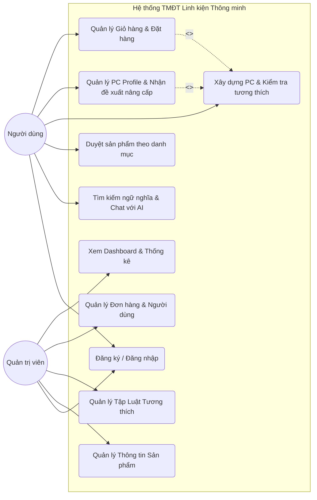

**Mục tiêu:**
*   **Mục đích:** Xây dựng một nền tảng thương mại điện tử chuyên biệt phân phối linh kiện điện tử/máy tính. Giải quyết khó khăn lớn nhất của người dùng khi tự lắp ráp (build) hoặc nâng cấp máy tính: sự thiếu hụt kiến thức về tính tương thích phần cứng, khó khăn trong việc tìm đúng mã sản phẩm và không biết bắt đầu nâng cấp từ đâu.
*   **Phạm vi:** 
    *   Hệ thống quản lý bán hàng cơ bản (Quản lý người dùng, Sản phẩm, Giỏ hàng, Thanh toán, Đơn hàng).
    *   **Công cụ kiểm tra tính tương thích (Compatibility Checker):** Tự động phát hiện xung đột phần cứng.
    *   **Hồ sơ cấu hình (PC Profile) & Đề xuất nâng cấp:** Lưu trữ cấu hình hiện tại của người dùng, phân tích điểm nghẽn (bottleneck) và gợi ý lộ trình nâng cấp.
    *   **Tích hợp AI suy luận (LLM - ví dụ: Gemini) vào Tìm kiếm:** Vượt ra ngoài việc tìm kiếm từ khóa hay chatbot thông thường, AI được sử dụng như một "chuyên gia phần cứng" có khả năng suy luận. AI giúp phân tích ngữ nghĩa truy vấn phức tạp của người dùng để tìm kiếm, tự động trích xuất thông số và đánh giá mức độ phù hợp của các linh kiện dựa trên nhu cầu cụ thể (ví dụ: render 3D vs. chơi game).
*   **Bối cảnh:** Nhu cầu tự tùy biến và nâng cấp thiết bị công nghệ ngày càng cao. Người dùng cần một hệ thống không chỉ để "mua" mà còn để "được tư vấn" như một chuyên gia phần cứng thực thụ.
*   **Tài liệu tham khảo:** Chuẩn tài liệu đặc tả yêu cầu phần mềm IEEE 830, tài liệu API tích hợp LLM (Gemini API / OpenAI API), tài liệu Elasticsearch.

### 1.1. Đặc tả Use-Case chi tiết

Dưới đây là đặc tả chi tiết cho các luồng nghiệp vụ (Use-case) cốt lõi của hệ thống, giúp làm rõ các kịch bản tương tác giữa người dùng, hệ thống AI, Rule Engine và Admin.

#### UC0: Đăng ký & Đăng nhập

**Mô tả:** Người dùng hoặc Quản trị viên đăng nhập vào hệ thống bằng tài khoản (Email/Mật khẩu) hoặc thông qua mạng xã hội (Google/Facebook).
**Actor chính:** Người dùng (User), Quản trị viên (Admin).
**Actor phụ:** OAuth Providers (Google, Facebook).
**Tiền điều kiện:** Người dùng chưa đăng nhập.

**Sơ đồ hoạt động (Activity Diagram):**
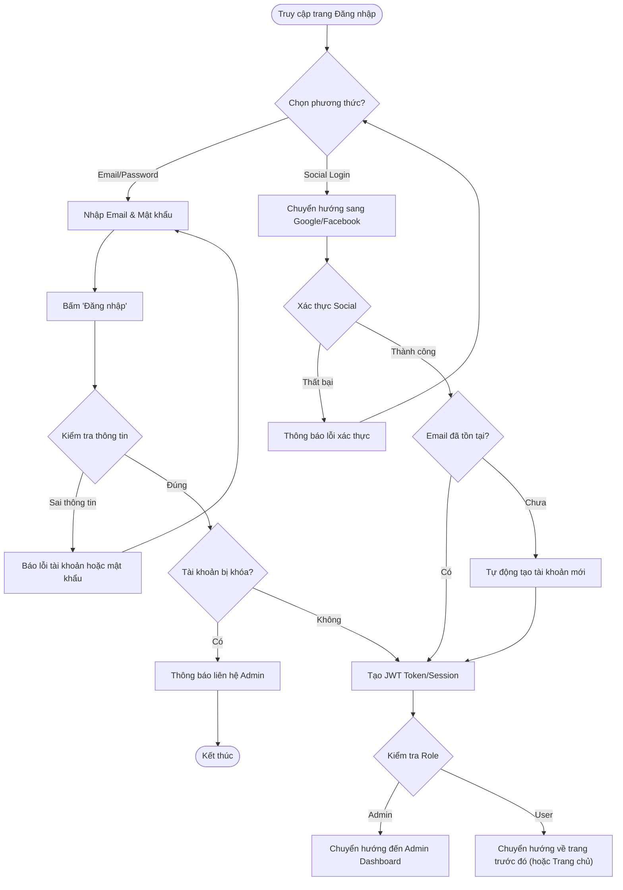

**Luồng sự kiện chính (Happy Path - Email/Password):**
1. Người dùng truy cập trang Đăng nhập.
2. Nhập thông tin `Email` và `Mật khẩu`.
3. Nhấn nút "Đăng nhập".
4. Hệ thống kiểm tra trùng khớp trong Database.
5. Kiểm tra trạng thái tài khoản (`is_active = true`).
6. Hệ thống tạo JWT Token (hoặc Session) lưu vào Cookie/Local Storage.
7. Điều hướng người dùng về trang họ đang truy cập trước đó (Ví dụ: đang ở Giỏ hàng -> Trở lại Giỏ hàng). Đối với Admin, điều hướng vào Admin Dashboard.

**Luồng sự kiện chính (Happy Path - Social Login):**
1. Người dùng nhấn nút "Đăng nhập bằng Google".
2. Hệ thống chuyển hướng sang cửa sổ xác thực của Google.
3. Người dùng cho phép quyền truy cập.
4. Google trả về Auth Code, hệ thống gọi lên Google API lấy thông tin Profile (Email, Name).
5. Nếu Email chưa có trong hệ thống, tự động tạo tài khoản mới. Nếu có rồi, tiến hành cấp JWT Token và đăng nhập thành công.

**Luồng ngoại lệ (Exception/Alternative Paths):**
*   *0a. Sai mật khẩu quá số lần quy định:* Nếu đăng nhập sai mật khẩu 5 lần liên tiếp, hệ thống khóa tài khoản tạm thời trong 15 phút và gửi email cảnh báo.
*   *0b. Tài khoản bị khóa (Banned):* Ở bước 5 (kiểm tra trạng thái), nếu `is_active = false`, hệ thống chặn đăng nhập và hiện thông báo: "Tài khoản của bạn đã bị khóa do vi phạm chính sách."

#### UC1: Tìm kiếm ngữ nghĩa & Chat với AI

**Mô tả:** Người dùng nhập yêu cầu bằng ngôn ngữ tự nhiên (không cần chính xác từ khóa kỹ thuật) để tìm kiếm linh kiện phù hợp với nhu cầu. AI sẽ đóng vai trò như một chuyên gia tư vấn.
**Actor chính:** Người dùng (User).
**Actor phụ:** AI Engine (Gemini), Vector DB.
**Tiền điều kiện:** Người dùng đang ở trang chủ hoặc thanh tìm kiếm. Hệ thống AI đang hoạt động.

**Sơ đồ hoạt động (Activity Diagram):**
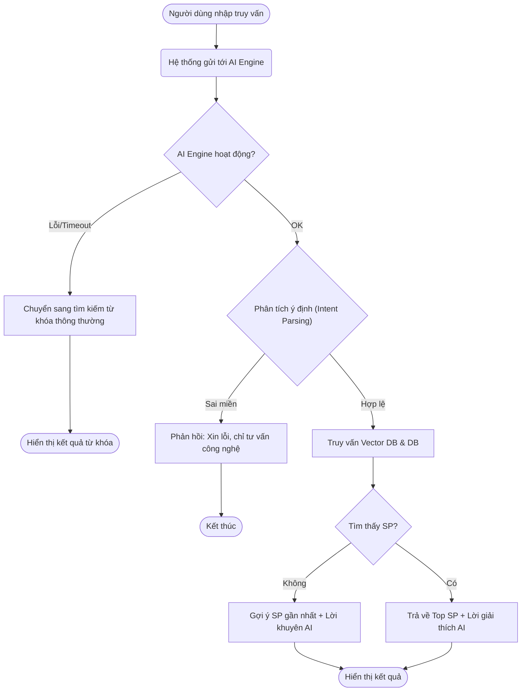

**Luồng sự kiện chính (Happy Path):**
1. Người dùng nhập câu truy vấn (Ví dụ: "Card màn hình nào dưới 8 triệu chơi mượt game AAA?").
2. Người dùng nhấn "Tìm kiếm" hoặc Enter.
3. Hệ thống gửi truy vấn đến AI Engine để phân tích ý định (Intent Parsing).
4. AI Engine bóc tách được: `Category = VGA`, `Budget <= 8000000`, `Purpose = Gaming AAA`.
5. Hệ thống truy vấn Vector DB và Database để tìm top 5 sản phẩm phù hợp nhất.
6. AI Engine nhận danh sách sản phẩm, tạo câu trả lời giải thích lý do đề xuất dựa trên nhu cầu của User.
7. Hệ thống hiển thị kết quả tìm kiếm gồm: Câu tư vấn của AI và Danh sách thẻ sản phẩm.

**Luồng ngoại lệ (Exception/Alternative Paths):**
*   *1a. AI Service không phản hồi (Timeout) hoặc báo lỗi:* Hệ thống tự động chuyển sang luồng tìm kiếm từ khóa thông thường (Fuzzy Search bằng Elasticsearch), bỏ qua phần tư vấn AI. Hiển thị thông báo: "AI tạm thời không khả dụng, hiển thị kết quả tìm kiếm theo từ khóa".
*   *1b. Truy vấn không liên quan (Ví dụ: "Thời tiết hôm nay thế nào?"):* AI nhận diện ý định sai miền. Hệ thống phản hồi: "Xin lỗi, tôi chỉ có thể tư vấn về linh kiện máy tính và thiết bị công nghệ."
*   *1c. Không tìm thấy sản phẩm thỏa mãn điều kiện:* Hệ thống hiển thị câu tư vấn của AI (ví dụ: "Hiện không có card nào dưới 8 triệu đáp ứng chơi mượt mọi game AAA Ultra setting") và gợi ý các sản phẩm gần mức giá nhất hoặc có hiệu năng tốt nhất trong tầm giá.

#### UC2: Xây dựng PC & Kiểm tra tương thích (PC Builder)

**Mô tả:** Người dùng chọn từng linh kiện để lắp ráp thành một bộ PC hoàn chỉnh. Hệ thống sẽ tự động kiểm tra và cảnh báo nếu các linh kiện xung đột hoặc không tối ưu.
**Actor chính:** Người dùng (User).
**Actor phụ:** Hardware Rule Engine.
**Tiền điều kiện:** Người dùng truy cập công cụ PC Builder.

**Sơ đồ hoạt động (Activity Diagram):**
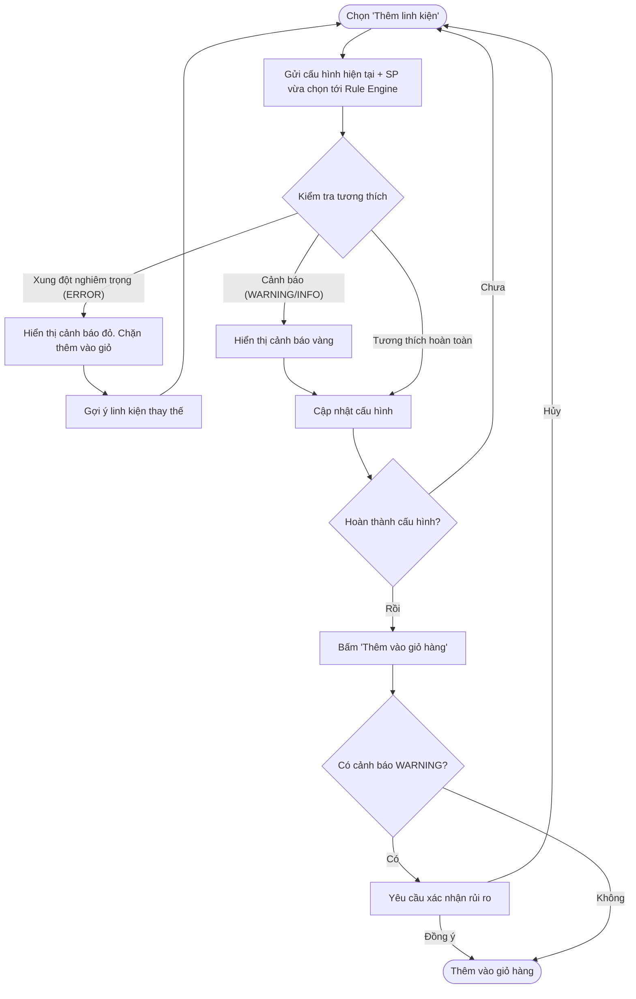

**Luồng sự kiện chính (Happy Path):**
1. Người dùng chọn mục "Thêm CPU" và chọn 1 CPU (VD: Intel Core i5 13600K).
2. Hệ thống gửi cấu hình hiện tại đến Rule Engine.
3. Rule Engine đánh giá không có xung đột, hệ thống cập nhật cấu hình và hiển thị CPU đã chọn.
4. Người dùng tiếp tục chọn "Thêm Mainboard" và chọn 1 Mainboard socket LGA 1700.
5. Hệ thống gửi danh sách (CPU, Mainboard) đến Rule Engine.
6. Rule Engine kiểm tra tương thích (Socket match) thành công.
7. Hệ thống hiển thị trạng thái "Tương thích" (Màu xanh).
8. Người dùng lặp lại đến khi hoàn thành cấu hình và bấm "Thêm toàn bộ vào giỏ hàng".

**Luồng ngoại lệ (Exception/Alternative Paths):**
*   *2a. Xung đột nghiêm trọng (ERROR):* Ở bước 4, nếu User chọn Mainboard socket AM5. Rule Engine trả về vi phạm mức ERROR. Hệ thống hiển thị cảnh báo đỏ ngay lập tức: "Mainboard không hỗ trợ CPU này (LGA1700 vs AM5)". Giao diện KHÔNG cho phép "Thêm toàn bộ vào giỏ hàng" cho đến khi lỗi được khắc phục. Hệ thống gợi ý danh sách Mainboard tương thích.
*   *2b. Cảnh báo không tối ưu (WARNING/INFO):* User chọn Nguồn (PSU) 450W cho cấu hình có RTX 4070. Rule Engine trả về WARNING. Hệ thống hiển thị cảnh báo vàng: "Công suất nguồn có thể không đủ tải (Khuyến nghị >= 650W)". User VẪN CÓ THỂ tiếp tục mua hàng nếu phớt lờ cảnh báo, hệ thống yêu cầu xác nhận rủi ro.

#### UC3: Quản lý PC Profile & Nhận đề xuất nâng cấp

**Mô tả:** Người dùng lưu lại cấu hình PC hiện tại của mình. Hệ thống sử dụng AI và Rule Engine để phân tích điểm nghẽn (bottleneck) của cấu hình và đưa ra lộ trình nâng cấp phù hợp với ngân sách.
**Actor chính:** Người dùng (User).
**Actor phụ:** AI Engine, Rule Engine.
**Tiền điều kiện:** Người dùng đã đăng nhập và truy cập trang PC Profile.

**Sơ đồ hoạt động (Activity Diagram):**
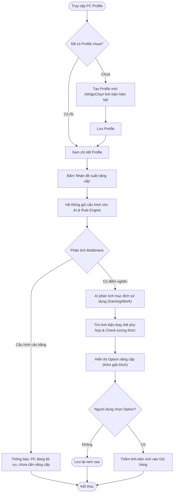

**Luồng sự kiện chính (Happy Path):**
1. Người dùng vào trang "PC Profile" và xem cấu hình hiện tại của mình (ví dụ: đang dùng Core i3 gen 10, GTX 1050).
2. Người dùng nhấn nút "Tư vấn nâng cấp".
3. Hệ thống hiển thị popup hỏi: "Ngân sách của bạn?" và "Mục tiêu nâng cấp (Ví dụ: Chơi mượt game XYZ)?".
4. Người dùng nhập thông tin và xác nhận.
5. AI Engine phân tích cấu hình hiện tại, nhận diện "VGA GTX 1050 là điểm nghẽn lớn nhất cho gaming".
6. AI tìm kiếm VGA mới phù hợp ngân sách, gửi qua Rule Engine kiểm tra xem nguồn (PSU) và Mainboard hiện tại có gánh được VGA mới không.
7. Hệ thống trả về đề xuất: "Nâng cấp lên RTX 3060 (Lý do...) + Đổi Nguồn lên 600W (Vì nguồn cũ không đủ)".
8. Người dùng đồng ý và nhấn "Thêm các món nâng cấp vào Giỏ hàng".

**Luồng ngoại lệ (Exception/Alternative Paths):**
*   *3a. Ngân sách quá thấp:* Ở bước 5, AI không tìm được linh kiện nào tạo ra sự nâng cấp rõ rệt với ngân sách cung cấp. Hệ thống phản hồi: "Ngân sách hiện tại khó tạo ra thay đổi lớn. Bạn nên tích lũy thêm khoảng X triệu hoặc tìm mua đồ cũ."
*   *3b. Cấu hình quá cũ không thể nâng cấp lẻ:* Ở bước 6, Rule Engine phát hiện Mainboard quá cũ không hỗ trợ linh kiện đời mới. AI đề xuất: "Cấu hình đã hết vòng đời nâng cấp. Bạn nên build một dàn PC mới hoàn toàn thay vì nâng cấp từng món."

#### UC4: Quản lý Giỏ hàng & Đặt hàng (Checkout)

**Mô tả:** Người dùng xem lại các sản phẩm đã chọn, nhập thông tin giao hàng, thanh toán và hoàn tất đơn hàng.
**Actor chính:** Người dùng (User).
**Tiền điều kiện:** Người dùng đã có sản phẩm trong giỏ hàng và đã đăng nhập (Nếu chưa đăng nhập sẽ được yêu cầu).

**Sơ đồ hoạt động (Activity Diagram):**
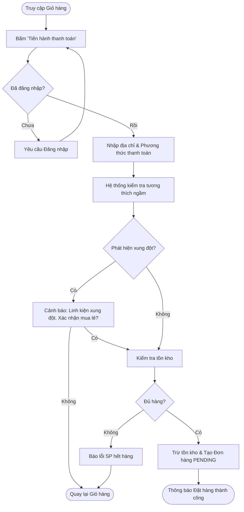

**Luồng sự kiện chính (Happy Path):**
1. Người dùng truy cập Giỏ hàng, kiểm tra lại danh sách linh kiện và tổng tiền.
2. Người dùng nhấn "Tiến hành Thanh toán".
3. *(Include UC0)* Nếu chưa đăng nhập, hệ thống điều hướng sang trang Đăng nhập. Sau khi đăng nhập thành công, quay lại trang Thanh toán.
4. Người dùng điền/chọn địa chỉ giao hàng và phương thức thanh toán (COD / Chuyển khoản).
5. Hệ thống tự động gọi hàm `CheckCompatibility()` lần cuối ngầm bên dưới (để đảm bảo không có linh kiện xung đột nào bị sót).
6. Kết quả trả về an toàn, Người dùng nhấn "Xác nhận đặt hàng".
7. Hệ thống trừ tồn kho (Stock quantity), tạo bản ghi Order mới với trạng thái PENDING.
8. Hệ thống hiển thị trang "Đặt hàng thành công" và gửi email xác nhận.

**Luồng ngoại lệ (Exception/Alternative Paths):**
*   *4a. Hết hàng (Out of stock) tại thời điểm checkout:* Ở bước 6, khi kiểm tra tồn kho, một sản phẩm trong giỏ đã hết. Hệ thống báo lỗi, bôi đỏ sản phẩm hết hàng và yêu cầu người dùng loại bỏ khỏi giỏ trước khi thanh toán.
*   *4b. Phát hiện xung đột (ERROR) ở bước check cuối:* Ở bước 5, nếu trong giỏ có chứa các linh kiện xung đột (do người dùng thêm lẻ từ trang chi tiết sản phẩm, không qua PC Builder). Hệ thống hiện Pop-up cảnh báo chặn (Blocker): "Phát hiện linh kiện không tương thích trong giỏ hàng. Bạn có chắc chắn muốn mua lẻ không?". Nếu User xác nhận "Mua lẻ", hệ thống cho phép qua bước 6.

#### UC5: Quản lý Thông tin Sản phẩm (Admin)

**Mô tả:** Admin thêm mới hoặc cập nhật thông tin linh kiện. Điểm đặc biệt của hệ thống là khi lưu sản phẩm, hệ thống sẽ tự động cập nhật thông số kỹ thuật (JSON) phục vụ Rule Engine và tạo Vector Embedding phục vụ AI Search.
**Actor chính:** Quản trị viên (Admin).
**Actor phụ:** AI Engine (Vector DB).
**Tiền điều kiện:** Admin đã đăng nhập vào trang Quản trị.

**Sơ đồ hoạt động (Activity Diagram):**
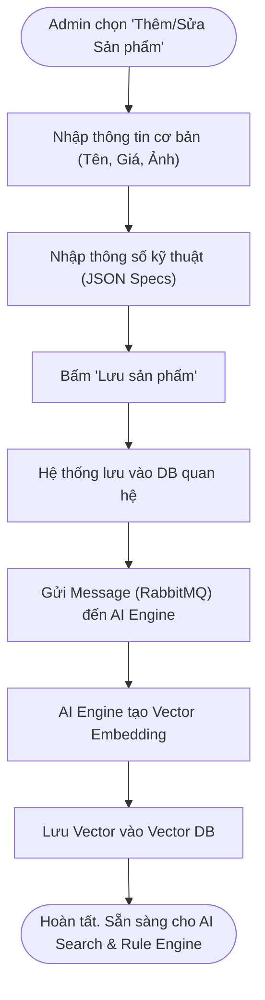

**Luồng sự kiện chính (Happy Path):**
1. Admin truy cập trang Quản lý Sản phẩm và chọn "Thêm mới".
2. Admin nhập các thông tin cơ bản: Tên, Hãng, Danh mục, Giá, Số lượng.
3. Admin nhập các trường thông số kỹ thuật động (Ví dụ: `socket_type: LGA1700`, `form_factor: ATX`).
4. Admin nhấn "Lưu". Hệ thống lưu dữ liệu vào bảng `Product`.
5. Hệ thống kích hoạt một sự kiện ngầm (Async task qua RabbitMQ) gửi data sản phẩm sang AI Service.
6. AI Service sinh vector ngữ nghĩa (Embedding) và lưu vào Vector DB.
7. Hệ thống hiển thị thông báo "Thêm sản phẩm thành công".

**Luồng ngoại lệ (Exception/Alternative Paths):**
*   *5a. Lỗi đồng bộ Vector DB:* Ở bước 6, AI Service bị lỗi không thể tạo vector. Hệ thống lưu log lỗi và đánh dấu sản phẩm `sync_status = FAILED`. Sản phẩm vẫn xuất hiện trên web nhưng sẽ không được tìm thấy qua AI Semantic Search cho đến khi Admin bấm "Đồng bộ lại" bằng tay.

#### UC6: Quản lý Tập Luật Tương thích (Admin)

**Mô tả:** Admin định nghĩa các quy tắc để hệ thống PC Builder biết linh kiện nào lắp được với nhau (Ví dụ: CPU Intel đời 13 phải đi với Mainboard LGA1700).
**Actor chính:** Quản trị viên (Admin).
**Actor phụ:** Rule Engine.
**Tiền điều kiện:** Admin đã đăng nhập vào trang Quản trị.

**Sơ đồ hoạt động (Activity Diagram):**
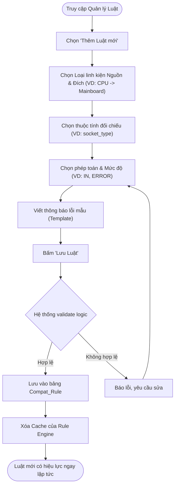

**Luồng sự kiện chính (Happy Path):**
1. Admin vào module "Luật Tương Thích".
2. Admin thiết lập luật mới: `Source=CPU`, `Target=Motherboard`.
3. Admin định nghĩa logic: Thuộc tính `socket_type` của CPU phải `IN` (nằm trong) mảng `supported_sockets` của Motherboard. Nếu vi phạm, báo mức `ERROR`.
4. Admin điền câu thông báo mẫu: "CPU {source_value} không lắp vừa mainboard này".
5. Admin nhấn Lưu.
6. Hệ thống kiểm tra tính hợp lệ của cấu trúc luật, lưu vào DB và tự động clear Cache của Go Rule Engine.
7. Các User đang dùng PC Builder ngay lập tức bị áp dụng luật mới này.

#### UC7: Quản lý Đơn hàng & Người dùng (Admin)

**Mô tả:** Admin theo dõi và cập nhật trạng thái các đơn hàng (Từ lúc chờ xác nhận đến khi giao thành công). Đồng thời, Admin có thể quản lý trạng thái của người dùng.
**Actor chính:** Quản trị viên (Admin).
**Tiền điều kiện:** Admin đã đăng nhập vào trang Quản trị.

**Sơ đồ hoạt động (Activity Diagram - Xử lý Đơn hàng):**
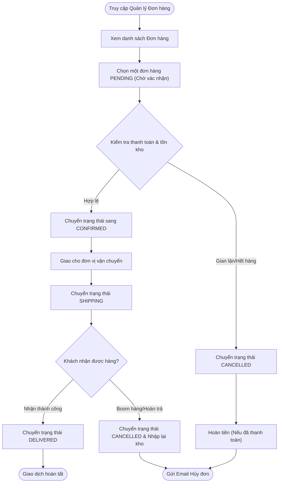

**Luồng sự kiện chính (Happy Path - Quản lý Đơn hàng):**
1. Admin truy cập module "Quản lý Đơn hàng".
2. Hệ thống hiển thị danh sách đơn hàng mới (Trạng thái `PENDING`).
3. Admin xem chi tiết đơn hàng, xác nhận thông tin thanh toán.
4. Admin nhấn "Xác nhận đơn". Trạng thái chuyển thành `CONFIRMED`. Hệ thống gửi email thông báo cho User.
5. Khi hàng được giao cho shipper, Admin cập nhật thành `SHIPPING`.
6. Khi có đối soát giao hàng thành công, Admin cập nhật thành `DELIVERED`.

**Luồng ngoại lệ (Exception/Alternative Paths):**
*   *7a. Hủy đơn hàng:* Nếu phát hiện gian lận hoặc hết hàng thực tế, Admin chuyển trạng thái sang `CANCELLED`. Hệ thống tự động hoàn lại số lượng tồn kho vào bảng `Product` và gửi email xin lỗi khách hàng.
*   *7b. Khóa tài khoản User:* Trong module "Quản lý Người dùng", nếu Admin phát hiện User có dấu hiệu boom hàng nhiều lần, Admin có thể đổi trạng thái User `is_active = false`. User này sẽ bị chặn đăng nhập (tham chiếu UC0).

## 2. Thiết kế kiến trúc phần mềm (High-Level Design)

**Sơ đồ Kiến trúc Hệ thống (System Architecture Diagram):**

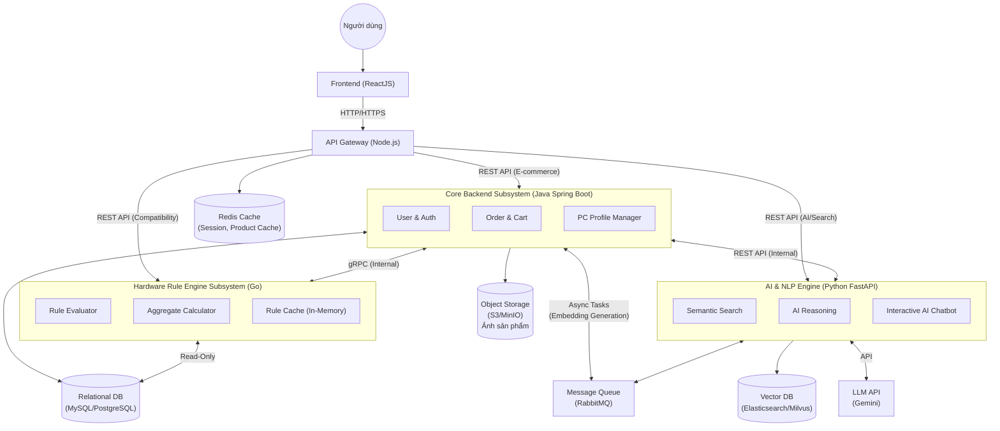

**Mô hình kiến trúc:**
Dự án sử dụng mô hình **Client-Server** kết hợp với kiến trúc **Microservices** (dựa trên **Service-Oriented Architecture - SOA**). 
*   **Client (Frontend):** Ứng dụng Web (ReactJS)[cite: 1].
*   **API Gateway:** Điều hướng request và luân chuyển dữ liệu qua RESTful API (Node.js).
*   **Core Backend:** Hệ thống nghiệp vụ E-commerce cốt lõi (Java - Spring Boot). Xử lý quản lý người dùng, đơn hàng, giỏ hàng, hồ sơ PC Profile. Giao tiếp với Rule Engine qua gRPC.
*   **Hardware Rule Engine (Microservice - Go):** Service chuyên biệt viết bằng Go (Golang), chịu trách nhiệm đánh giá tính tương thích phần cứng với hiệu năng cao. Go được chọn vì tốc độ xử lý rule nhanh (compiled native, zero overhead), goroutines cho phép đánh giá nhiều rule song song, và tiêu tốn rất ít RAM (~10-30MB). Nhận request trực tiếp từ API Gateway qua REST API, hoặc từ Core Backend qua gRPC khi cần kiểm tra tương thích trong luồng đặt hàng.
*   **AI Reasoning & NLP Engine (Microservices):** Trái tim thông minh của hệ thống (Python - FastAPI), giao tiếp trực tiếp với Vector Database và các mô hình ngôn ngữ lớn (LLM như Gemini) để thực hiện các tác vụ suy luận và tìm kiếm ngữ nghĩa[cite: 1]. Giao tiếp với Core Backend qua RESTful API.

**Phân rã hệ thống (Modules):**
1.  **User & E-commerce Core Subsystem (Java Spring Boot):** Quản lý tài khoản, danh mục, giỏ hàng, đơn hàng, hồ sơ PC Profile[cite: 1].
2.  **Hardware Rule Engine Subsystem (Go):** Microservice độc lập viết bằng Go, chuyên đánh giá tính tương thích phần cứng. Nhận danh sách linh kiện, tải luật từ DB, tính toán aggregate values, đánh giá song song các rule bằng goroutines và trả về kết quả vi phạm. Giao tiếp với Core Backend qua gRPC[cite: 1].
3.  **Semantic Search Subsystem (Python FastAPI):** Khác với tìm kiếm truyền thống, module này kết hợp Elasticsearch (Fuzzy Search) và vector hóa dữ liệu (Vector Database) để tìm kiếm dựa trên "ý nghĩa" câu chữ[cite: 1].
4.  **AI Reasoning Subsystem (Python FastAPI):** Nhận đầu vào là các yêu cầu mơ hồ, sử dụng LLM để[cite: 1]:
    *   Suy luận ra nhu cầu cấu hình thực tế (VD: "Máy làm đồ họa kiến trúc" -> Cần ưu tiên CPU đa nhân, RAM lớn, Card Nvidia)[cite: 1].
5.  **Interactive AI Chatbot (Python FastAPI):** Giao diện giao tiếp bằng ngôn ngữ tự nhiên, đóng vai trò luân chuyển dữ liệu từ người dùng đến các module AI phía trên và trả kết quả dưới dạng hội thoại[cite: 1].

## 3. Thiết kế dữ liệu (Database Design)

**Sơ đồ thực thể liên kết (ERD):**


**Mô tả các thực thể AI Context:**
*   Các bảng cơ bản vẫn giữ nguyên: `User`, `Order`, `Product`, `Category`, `PC_Profile`, `Compat_Rule`[cite: 1].
*   **Thêm thực thể cho AI:**
    *   `Product_Embeddings`: (1) Product - (1) Product_Embeddings (Chứa vector biểu diễn thông tin sản phẩm để phục vụ Semantic Search)[cite: 1].

**Từ điển dữ liệu bổ sung:**

| Tên bảng | Tên trường | Kiểu dữ liệu | Ràng buộc | Mô tả |
| :--- | :--- | :--- | :--- | :--- |
| **Product_Embeddings**[cite: 1]| `product_id`[cite: 1] | UUID[cite: 1] | Primary Key/FK[cite: 1] | Mã sản phẩm[cite: 1] |
| | `embedding_vector`[cite: 1] | VECTOR[cite: 1] | | Vector ngữ nghĩa của tên, mô tả và thông số kỹ thuật (dùng để query bằng độ tương tự cosine)[cite: 1] |
| **Compat_Rule** | `rule_id` | UUID | Primary Key | Mã định danh quy tắc tương thích |
| | `rule_name` | VARCHAR(255) | NOT NULL | Tên mô tả quy tắc (VD: "CPU-Motherboard Socket Match") |
| | `source_category` | VARCHAR(100) | NOT NULL, FK → Category | Loại linh kiện nguồn cần kiểm tra (VD: `CPU`) |
| | `target_category` | VARCHAR(100) | NOT NULL, FK → Category | Loại linh kiện đích để đối chiếu (VD: `Motherboard`) |
| | `source_spec_key` | VARCHAR(100) | NOT NULL | Key thông số kỹ thuật ở linh kiện nguồn (VD: `socket_type`) |
| | `target_spec_key` | VARCHAR(100) | NOT NULL | Key thông số kỹ thuật ở linh kiện đích (VD: `supported_sockets`) |
| | `operator` | ENUM('EQUALS', 'IN', 'NOT_IN', 'LTE', 'GTE', 'RANGE') | NOT NULL | Phép so sánh giữa source_spec và target_spec |
| | `severity` | ENUM('ERROR', 'WARNING', 'INFO') | NOT NULL | Mức độ nghiêm trọng: `ERROR` = chặn thêm giỏ hàng, `WARNING` = cảnh báo, `INFO` = gợi ý |
| | `error_message_template` | TEXT | NOT NULL | Template thông báo khi vi phạm, hỗ trợ placeholder `{source_value}`, `{target_value}` |
| | `is_active` | BOOLEAN | DEFAULT TRUE | Bật/tắt quy tắc mà không cần xóa |
| | `priority` | INT | DEFAULT 0 | Thứ tự ưu tiên đánh giá (số nhỏ = ưu tiên cao) |
| | `created_at` | TIMESTAMP | DEFAULT NOW() | Thời điểm tạo quy tắc |

*Quan hệ: `Compat_Rule.source_category` và `Compat_Rule.target_category` → FK tham chiếu đến `Category.category_name`. Mỗi quy tắc áp dụng lên một cặp loại linh kiện (VD: CPU ↔ Motherboard, RAM ↔ Motherboard, GPU ↔ Case). Thông số kỹ thuật (`source_spec_key`, `target_spec_key`) tham chiếu đến các key trong trường JSON specs của bảng `Product`.*

**Dữ liệu mẫu quy tắc tương thích (Compat_Rule Seed Data):**

| rule_name | source → target | source_spec_key | operator | target_spec_key | severity |
| :--- | :--- | :--- | :--- | :--- | :--- |
| CPU-Motherboard Socket Match | CPU → Motherboard | `socket_type` | IN | `supported_sockets` | ERROR |
| RAM Type Compatibility | RAM → Motherboard | `memory_type` | IN | `supported_memory_types` | ERROR |
| RAM Slot Count | RAM (count) → Motherboard | `_count` | LTE | `ram_slots` | ERROR |
| Max RAM Capacity | RAM (tổng) → Motherboard | `_sum_capacity_gb` | LTE | `max_ram_gb` | ERROR |
| GPU Length vs Case | GPU → Case | `length_mm` | LTE | `max_gpu_length_mm` | ERROR |
| CPU Cooler Socket Support | CPU → CPU_Cooler | `socket_type` | IN | `supported_sockets` | ERROR |
| PSU Wattage Sufficiency | _SYSTEM (tổng TDP) → PSU | `_total_tdp_w` | LTE | `rated_wattage_w` | WARNING |
| Mainboard Form Factor vs Case | Motherboard → Case | `form_factor` | IN | `supported_form_factors` | ERROR |
| M.2 Slot Count | SSD_M2 (count) → Motherboard | `_count` | LTE | `m2_slots` | WARNING |
| PCIe Generation | GPU → Motherboard | `pcie_gen` | LTE | `max_pcie_gen` | INFO |

> *Lưu ý thiết kế: Các `spec_key` bắt đầu bằng `_` (VD: `_count`, `_sum_capacity_gb`, `_total_tdp_w`) là các giá trị tính toán động (aggregate), được Rule Engine tính từ danh sách linh kiện trong PC Profile, không phải trường trực tiếp trong bảng Product.*

> *Lưu ý kiến trúc: Vector Database chứa bảng `Product_Embeddings` sẽ được thiết kế nằm chung mạng nội bộ (VPC) với Python AI Service. Quá trình Semantic Search sẽ được truy vấn nội bộ tại đây, sau đó Python Service chỉ trả về mảng danh sách `product_id` cho Java Core qua REST API để lấy thông tin chi tiết, nhằm tối ưu băng thông mạng.*

## 4. Thiết kế chi tiết (Low-Level Design / Internal Design)

**Sơ đồ tuần tự: Luồng Tìm kiếm ngữ nghĩa & Suy luận với LLM**

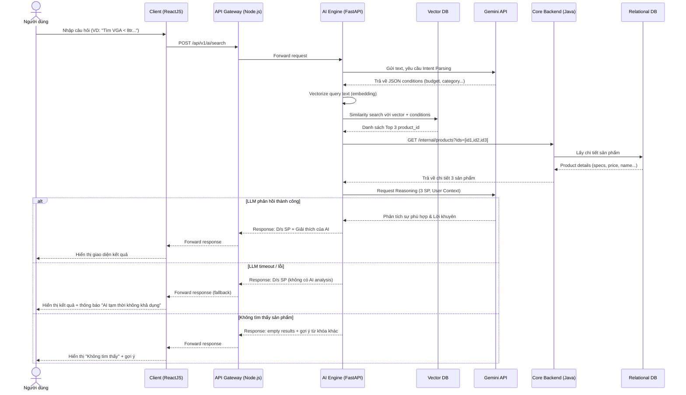

**Luồng xử lý (Data Flow): Luồng Tìm kiếm ngữ nghĩa & Suy luận với LLM**[cite: 1]
1.  **Input:** Người dùng nhập: *"Cần mua card màn hình dưới 8 triệu chạy mượt Cyberpunk 2077 và thỉnh thoảng edit video"*[cite: 1].
2.  **Intent Parsing (LLM):** Hệ thống gửi chuỗi này đến LLM (Gemini)[cite: 1]. AI suy luận và trích xuất ra các điều kiện: `{ "budget": <= 8000000, "category": "VGA", "keywords": ["gaming high-end", "video editing"], "brand_preference": "Nvidia (tốt cho edit video)" }`[cite: 1].
3.  **Database Query:** Hệ thống dùng JSON trên để query vào database hoặc Vector DB, lấy ra top 3 sản phẩm phù hợp nhất (VD: RTX 4060, RX 7600)[cite: 1].
4.  **AI Reasoning & Generation:** Gửi danh sách 3 sản phẩm này ngược lại cho LLM yêu cầu giải thích sự phù hợp dựa trên ngữ cảnh người dùng[cite: 1].
5.  **Output:** Trả về kết quả hiển thị cho Frontend gồm: Danh sách sản phẩm + Đoạn giải thích suy luận của AI (VD: *"RTX 4060 được đề xuất vì hỗ trợ CUDA tốt cho việc edit video của bạn..."*)[cite: 1].

---

**Sơ đồ tuần tự: Luồng Kiểm tra tính tương thích phần cứng (Compatibility Check)**

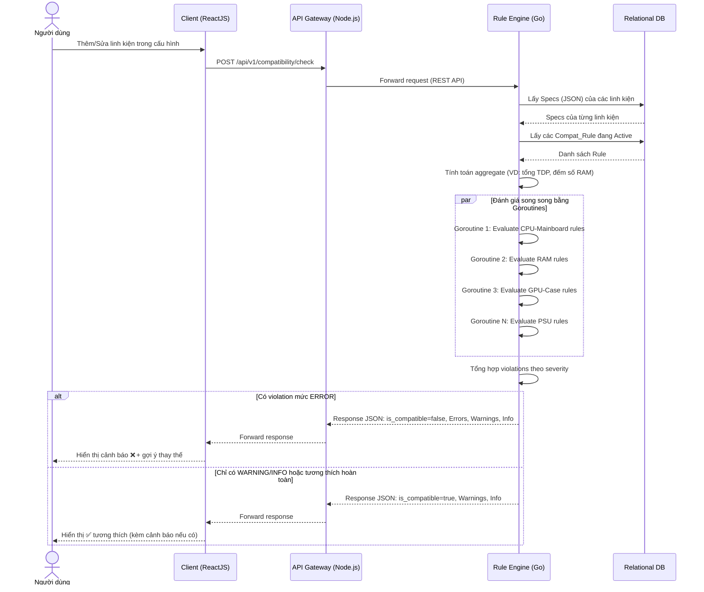

**Luồng xử lý (Data Flow): Luồng Kiểm tra tính tương thích phần cứng (Compatibility Check)**
1.  **Input:** Người dùng thêm linh kiện vào giỏ hàng hoặc vào PC Profile Builder (VD: chọn CPU Intel i7-13700K khi đã có Mainboard ASUS ROG X670E socket AM5).
2.  **Fetch Specs:** Rule Engine (Go) nhận request từ API Gateway, truy vấn bảng `Product` để lấy thông số kỹ thuật (JSON specs) của tất cả linh kiện hiện có trong cấu hình.
3.  **Load Rules:** Rule Engine tải toàn bộ quy tắc `is_active = TRUE` từ bảng `Compat_Rule` (có cache in-memory để tối ưu), lọc theo các cặp `source_category` ↔ `target_category` có mặt trong cấu hình.
4.  **Evaluate (Song song bằng Goroutines):** Các rule được nhóm theo cặp category và đánh giá song song bằng goroutines. Với mỗi quy tắc, engine trích xuất giá trị `source_spec_key` và `target_spec_key` từ specs của linh kiện tương ứng, sau đó thực hiện phép so sánh theo `operator`:
    *   `EQUALS`: source_value == target_value
    *   `IN`: source_value nằm trong danh sách target_value
    *   `LTE` / `GTE`: source_value <= / >= target_value (dùng cho số)
    *   Với các aggregate key (bắt đầu bằng `_`): tính toán từ tập linh kiện (VD: đếm số thanh RAM, tổng dung lượng RAM, tổng TDP).
5.  **Output:** Tổng hợp kết quả từ tất cả goroutines, trả về danh sách vi phạm (violations) kèm severity. Nếu có bất kỳ violation nào ở mức `ERROR`, hệ thống hiển thị cảnh báo và có thể chặn thêm vào giỏ hàng.

**Đặc tả API cho module kiểm tra tương thích (Module Specification):**
*   **REST Endpoint:** `POST /api/v1/compatibility/check` (Thuộc Rule Engine - Go)
*   **gRPC Endpoint:** `rpc CheckCompatibility(CheckRequest) returns (CheckResponse)` (Giao tiếp nội bộ từ Java Core, VD: khi người dùng đặt hàng, Java Core gọi Go Rule Engine qua gRPC để kiểm tra lần cuối trước khi xác nhận đơn)
*   **Tên hàm nội bộ (Go):** `CheckCompatibility()`
*   **Mô tả:** Nhận danh sách ID sản phẩm, đánh giá tính tương thích dựa trên các quy tắc trong bảng `Compat_Rule`, trả về kết quả chi tiết.
*   **Đầu vào (Request Body JSON):**
    `{ "product_ids": ["uuid-cpu", "uuid-mainboard", "uuid-ram-1", "uuid-ram-2", "uuid-gpu", "uuid-psu", "uuid-case"] }`
*   **Xử lý:** Nhận request → Fetch `Product` specs cho từng ID → Load `Compat_Rule` (active, có cache) → Tính aggregate values → Đánh giá song song các rule bằng goroutines → Tổng hợp violations theo severity.
*   **Kết quả trả về (Response JSON):**
```json
{
  "is_compatible": false,
  "errors": [
    {
      "rule_name": "CPU-Motherboard Socket Match",
      "severity": "ERROR",
      "message": "CPU socket LGA1700 không tương thích với Mainboard (hỗ trợ: AM5)",
      "source_product": { "id": "uuid-cpu", "name": "Intel Core i7-13700K" },
      "target_product": { "id": "uuid-mainboard", "name": "ASUS ROG X670E" }
    }
  ],
  "warnings": [
    {
      "rule_name": "PSU Wattage Sufficiency",
      "severity": "WARNING",
      "message": "Tổng TDP hệ thống (380W) đang gần ngưỡng 80% công suất PSU (500W). Khuyến nghị nâng cấp nguồn.",
      "source_product": null,
      "target_product": { "id": "uuid-psu", "name": "Corsair CV550" }
    }
  ],
  "info": []
}
```

---

**Sơ đồ tuần tự: Luồng Đặt hàng & Thanh toán (Checkout Flow)**

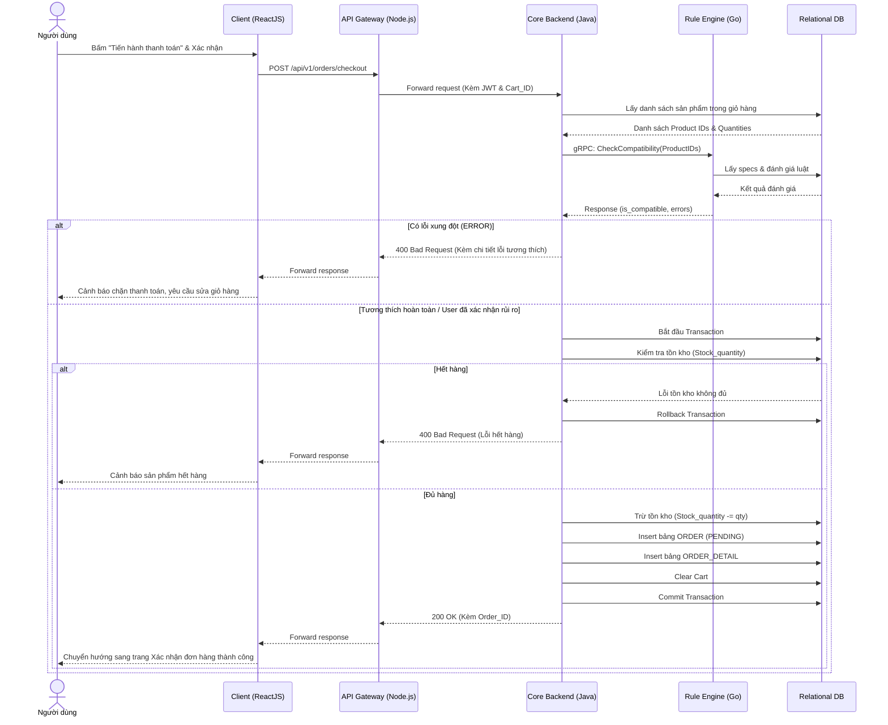

**Luồng xử lý (Data Flow): Luồng Đặt hàng & Thanh toán (Checkout Flow)**
1. **Input:** Người dùng xác nhận thanh toán giỏ hàng (chứa danh sách các sản phẩm và thông tin giao hàng).
2. **Compatibility Check (Ngầm):** Core Backend (Java) trước khi tạo đơn sẽ tổng hợp danh sách ID linh kiện và gọi gRPC sang Hardware Rule Engine (Go) để kiểm tra lại toàn bộ giỏ hàng, đề phòng trường hợp người dùng thêm lẻ các linh kiện xung đột vào giỏ (VD: mua CPU AMD và Mainboard Intel).
3. **Database Transaction:** Nếu tương thích (hoặc người dùng đã chủ động xác nhận mua rời), Java Core mở một ACID transaction. Tiến hành kiểm tra và trừ tồn kho các sản phẩm, tạo record vào bảng `ORDER` và `ORDER_DETAIL`, đồng thời xóa dữ liệu trong giỏ hàng.
4. **Rollback & Error Handling:** Nếu bất kỳ bước nào thất bại (Go phát hiện xung đột, hoặc DB báo hết hàng), toàn bộ quá trình sẽ được Rollback, DB không thay đổi, và thông báo lỗi tương ứng được trả về để Frontend hiển thị cho người dùng xử lý.

---

**Sơ đồ tuần tự: Luồng Phân tích PC Profile & Đề xuất Nâng cấp**

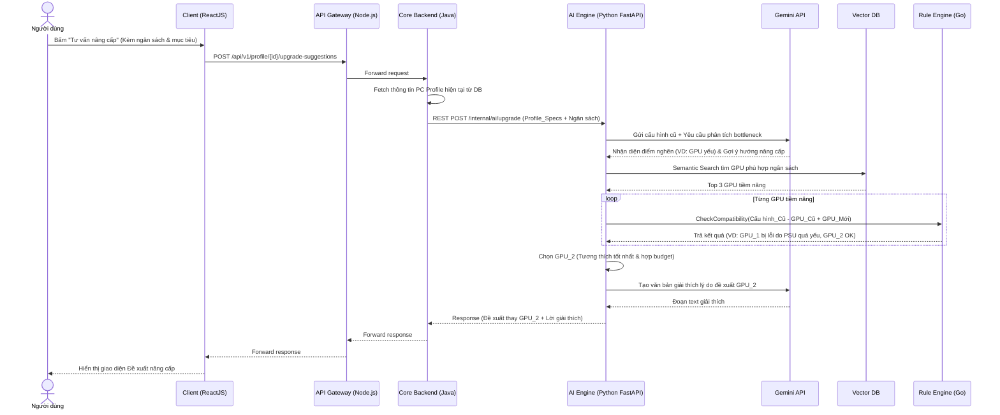

**Luồng xử lý (Data Flow): Luồng Phân tích PC Profile & Đề xuất Nâng cấp**
1. **Input:** Người dùng yêu cầu tư vấn nâng cấp dựa trên PC Profile có sẵn, kèm theo mức ngân sách và nhu cầu (VD: "Có 5 triệu, muốn chơi game mượt hơn").
2. **AI Bottleneck Analysis:** AI Engine (Python) gửi thông số chi tiết dàn PC cũ và mục tiêu của người dùng cho Gemini LLM để đánh giá tìm ra "điểm nghẽn" (bottleneck) cản trở hiệu năng (VD: CPU quá yếu so với GPU hiện tại).
3. **AI Search:** Khi biết cần thay linh kiện gì (VD: cần thay CPU), AI dùng Vector DB tìm các CPU thỏa mãn mức ngân sách.
4. **Rule Engine Validation (Bước chốt chặn):** AI Engine không tự tiện trả kết quả ngay. Nó thay thử từng linh kiện ứng viên vào cấu hình cũ và gọi Rule Engine (Go) để kiểm tra. Ví dụ: Nếu CPU mới khác socket so với Mainboard cũ, Rule Engine sẽ báo ERROR. Khi đó AI sẽ biết phải gợi ý thay cả Mainboard, hoặc tìm CPU khác cùng socket.
5. **Output:** Sau khi tìm được phương án tối ưu (Hiệu năng tốt + Đúng ngân sách + Rule Engine báo tương thích an toàn), AI sẽ sinh văn bản giải thích lý luận của mình và trả về Frontend để người dùng tham khảo và bấm "Thêm vào giỏ".

## 5. Thiết kế giao diện người dùng (UI/UX)

### 5.1. Sơ đồ di chuyển màn hình (Screen Navigation Flow)

Luồng thao tác chính của người dùng giữa các màn hình:
```mermaid
flowchart TD
    Login[Đăng nhập / Đăng ký\n(Login / Register)]
    Home[Trang chủ\n(Home)]
    Search[Tìm kiếm\n(Search)]
    Category[Danh mục\n(Category)]
    Builder[PC Builder\n(Compat Checker)]
    Profile[PC Profile\n(Cấu hình của tôi)]
    Account[Tài khoản\n(Account / Order History)]
    Detail[Chi tiết SP\n(Product Detail)]
    Cart[Giỏ hàng\n(Cart)]
    CompatResult[Kết quả Tương thích\n(Compat Result)]
    UpgradeSuggest[Đề xuất Nâng cấp\n(Upgrade Suggest)]
    Checkout[Thanh toán\n(Checkout)]
    OrderConfirm[Xác nhận Đơn hàng\n(Order Confirm)]

    Login --> Home
    Home --> Search
    Home --> Category
    Home --> Builder
    Home --> Profile
    Home --> Account

    Search --> Detail
    Category --> Detail
    Builder --> Detail

    Detail --> Cart
    Builder --> CompatResult
    Profile --> UpgradeSuggest
    UpgradeSuggest --> Detail

    Cart --> Checkout
    Checkout --> OrderConfirm

    subgraph Admin_Panel ["Khu vực Quản trị (Admin)"]
        AdminDashboard[Dashboard\n(Thống kê)]
        AdminProducts[Quản lý Sản phẩm\n(Products)]
        AdminOrders[Quản lý Đơn hàng\n(Orders)]
        AdminRules[Quản lý Luật tương thích\n(Compat Rules)]
        AdminUsers[Quản lý Người dùng\n(Users)]
        AdminDashboard --> AdminProducts
        AdminDashboard --> AdminOrders
        AdminDashboard --> AdminRules
        AdminDashboard --> AdminUsers
    end

    Login -->|Admin| AdminDashboard
```

**Mô tả các luồng di chuyển chính:**

| STT | Luồng | Mô tả |
| :--- | :--- | :--- |
| 1 | Đăng nhập → Trang chủ → Tìm kiếm → Chi tiết SP → Giỏ hàng → Thanh toán → Xác nhận | Luồng mua hàng cơ bản |
| 2 | Trang chủ → Danh mục → Chi tiết SP | Duyệt sản phẩm theo danh mục |
| 3 | Trang chủ → PC Builder → Chọn linh kiện → Kết quả Tương thích | Xây dựng cấu hình và kiểm tra tương thích real-time |
| 4 | PC Builder → Chi tiết SP → Giỏ hàng | Từ builder, xem chi tiết rồi thêm cả bộ vào giỏ |
| 5 | Trang chủ → PC Profile → Đề xuất Nâng cấp → Chi tiết SP → Giỏ hàng | Xem cấu hình, nhận gợi ý nâng cấp, xem chi tiết và mua |
| 6 | Trang chủ → Tài khoản | Xem lịch sử đơn hàng, chỉnh sửa thông tin cá nhân |
| 7 | Đăng nhập (Admin) → Dashboard → Quản lý SP / Đơn hàng / Luật / Người dùng | Luồng quản trị hệ thống |

### 5.2. Bản vẽ giao diện (Layout / Mockup)

#### Màn hình 0: Đăng nhập / Đăng ký (Login / Register)

```
┌──────────────────────────────────────────────────────────────────┐
│  [Logo]              NỀN TẢNG LINH KIỆN ĐIỆN TỬ THÔNG MINH     │
├──────────────────────────────────────────────────────────────────┤
│                                                                  │
│              ┌──────────────────────────────────┐                │
│              │  [Đăng nhập]  |  Đăng ký          │                │
│              ├──────────────────────────────────┤                │
│              │                                  │                │
│              │  📧 Email                        │                │
│              │  ┌──────────────────────────┐    │                │
│              │  │ user@example.com         │    │                │
│              │  └──────────────────────────┘    │                │
│              │                                  │                │
│              │  🔒 Mật khẩu                     │                │
│              │  ┌──────────────────────────┐    │                │
│              │  │ ••••••••••••             │    │                │
│              │  └──────────────────────────┘    │                │
│              │                                  │                │
│              │  ☐ Ghi nhớ đăng nhập             │                │
│              │                                  │                │
│              │  ┌──────────────────────────┐    │                │
│              │  │     🔓 ĐĂNG NHẬP         │    │                │
│              │  └──────────────────────────┘    │                │
│              │                                  │                │
│              │  ── Hoặc đăng nhập bằng ──────  │                │
│              │  [Google]    [Facebook]           │                │
│              │                                  │                │
│              │  Quên mật khẩu?                  │                │
│              └──────────────────────────────────┘                │
│                                                                  │
├──────────────────────────────────────────────────────────────────┤
│  Footer: Về chúng tôi | Chính sách | Liên hệ | © 2025          │
└──────────────────────────────────────────────────────────────────┘
```

*Khi chọn tab "Đăng ký", form bổ sung thêm: Họ tên, Số điện thoại, Xác nhận mật khẩu.*

#### Màn hình 1: Trang chủ (Home)

```
┌──────────────────────────────────────────────────────────────────┐
│  [Logo]          [Tìm kiếm AI _______________🔍]    [🛒] [👤]  │
│  Trang chủ | Danh mục ▼ | PC Builder | PC Profile              │
├──────────────────────────────────────────────────────────────────┤
│                                                                  │
│  ┌────────────────────────────────────────────────────────────┐  │
│  │              🖥️  BANNER KHUYẾN MÃI / COMBO HOT            │  │
│  │         "Build PC Gaming từ 15 triệu - Tặng tản nhiệt"   │  │
│  │                    [Xem ngay →]                            │  │
│  └────────────────────────────────────────────────────────────┘  │
│                                                                  │
│  ── Danh mục nổi bật ──────────────────────────────────────────  │
│  ┌────────┐ ┌────────┐ ┌────────┐ ┌────────┐ ┌────────┐        │
│  │  CPU   │ │  GPU   │ │  RAM   │ │  SSD   │ │Mainboard│       │
│  │  🔲    │ │  🔲    │ │  🔲    │ │  🔲    │ │  🔲     │       │
│  └────────┘ └────────┘ └────────┘ └────────┘ └────────┘        │
│                                                                  │
│  ── Sản phẩm bán chạy ────────────────────────────────────────  │
│  ┌──────────┐ ┌──────────┐ ┌──────────┐ ┌──────────┐           │
│  │ [Ảnh SP] │ │ [Ảnh SP] │ │ [Ảnh SP] │ │ [Ảnh SP] │           │
│  │ Tên SP   │ │ Tên SP   │ │ Tên SP   │ │ Tên SP   │           │
│  │ ⭐⭐⭐⭐  │ │ ⭐⭐⭐⭐⭐│ │ ⭐⭐⭐⭐  │ │ ⭐⭐⭐⭐⭐│           │
│  │ 3.990.000│ │ 8.490.000│ │ 1.290.000│ │ 5.690.000│           │
│  │[Thêm 🛒]│ │[Thêm 🛒]│ │[Thêm 🛒]│ │[Thêm 🛒]│           │
│  └──────────┘ └──────────┘ └──────────┘ └──────────┘           │
│                                                                  │
│  ── 💬 Hỏi chuyên gia AI ─────────────────────────────────────  │
│  ┌────────────────────────────────────────────────────────────┐  │
│  │  "Bạn cần tư vấn gì? VD: Máy chơi game 20 triệu..."     │  │
│  │  [____________________________________] [Gửi]             │  │
│  └────────────────────────────────────────────────────────────┘  │
│                                                                  │
├──────────────────────────────────────────────────────────────────┤
│  Footer: Về chúng tôi | Chính sách | Liên hệ | © 2025          │
└──────────────────────────────────────────────────────────────────┘
```

#### Màn hình 2: Tìm kiếm thông minh (AI Search)

```
┌──────────────────────────────────────────────────────────────────┐
│  [Logo]     [Card đồ họa chơi game tầm 8 triệu 🔍]  [🛒] [👤] │
├──────────────────────────────────────────────────────────────────┤
│                                                                  │
│  🤖 AI hiểu: "VGA gaming, budget ≤ 8tr, ưu tiên Nvidia"        │
│  ┌────────────────────────────────────────────────────────────┐  │
│  │ 💡 AI gợi ý: Với nhu cầu chơi game, bạn nên ưu tiên GPU  │  │
│  │ có VRAM ≥ 8GB. Nvidia RTX 40xx hỗ trợ DLSS 3 tốt cho     │  │
│  │ gaming. Nếu thỉnh thoảng edit video, CUDA cores sẽ hữu ích│ │
│  └────────────────────────────────────────────────────────────┘  │
│                                                                  │
│  Bộ lọc: [Hãng ▼] [Giá ▼] [VRAM ▼] [Còn hàng ☑]              │
│                                                                  │
│  ── Kết quả (12 sản phẩm) ─── Sắp xếp: [Phù hợp nhất ▼] ──── │
│                                                                  │
│  ┌──────────────────────────────────────────────────────────┐   │
│  │ [Ảnh]  RTX 4060 8GB GDDR6                    7.990.000đ │   │
│  │        ⭐⭐⭐⭐⭐ (234)  │ VRAM: 8GB │ TDP: 115W          │   │
│  │        🤖 "Phù hợp 95% nhu cầu của bạn"                 │   │
│  │        [Thêm vào 🛒]  [Xem chi tiết →]              │   │
│  └──────────────────────────────────────────────────────────┘   │
│  ┌──────────────────────────────────────────────────────────┐   │
│  │ [Ảnh]  RX 7600 8GB GDDR6                     6.490.000đ │   │
│  │        ⭐⭐⭐⭐ (187)   │ VRAM: 8GB │ TDP: 165W           │   │
│  │        🤖 "Giá tốt hơn, hiệu năng gaming tương đương"    │   │
│  │        [Thêm vào 🛒]  [Xem chi tiết →]              │   │
│  └──────────────────────────────────────────────────────────┘   │
│                                                                  │
└──────────────────────────────────────────────────────────────────┘
```

**Trạng thái Loading (khi AI đang xử lý, ~2-5 giây):**
```
┌──────────────────────────────────────────────────────────────────┐
│  [Logo]     [Card đồ họa chơi game tầm 8 triệu 🔍]  [🛒] [👤] │
├──────────────────────────────────────────────────────────────────┤
│                                                                  │
│  🤖 AI đang phân tích yêu cầu của bạn...                        │
│  ┌────────────────────────────────────────────────────────────┐  │
│  │  ░░░░░░░░░░░░░░░░░░░░░░░░░░░  (Skeleton loading)         │  │
│  │  ░░░░░░░░░░░░░░░░░░░░                                    │  │
│  └────────────────────────────────────────────────────────────┘  │
│                                                                  │
│  ── Kết quả đang tải ─────────────────────────────────────────  │
│  ┌──────────────────────────────────────────────────────────┐   │
│  │  ░░░░░░  ░░░░░░░░░░░░░░░░░░░░░░░░  (Skeleton card)     │   │
│  │          ░░░░░░░░░░░░░░░                                 │   │
│  │          ░░░░░░░░                                        │   │
│  └──────────────────────────────────────────────────────────┘   │
│  ┌──────────────────────────────────────────────────────────┐   │
│  │  ░░░░░░  ░░░░░░░░░░░░░░░░░░░░░░░░  (Skeleton card)     │   │
│  │          ░░░░░░░░░░░░░░░                                 │   │
│  │          ░░░░░░░░                                        │   │
│  └──────────────────────────────────────────────────────────┘   │
└──────────────────────────────────────────────────────────────────┘
```

**Trạng thái Lỗi (khi AI không khả dụng):**
```
┌──────────────────────────────────────────────────────────────────┐
│  [Logo]     [Card đồ họa chơi game tầm 8 triệu 🔍]  [🛒] [👤] │
├──────────────────────────────────────────────────────────────────┤
│                                                                  │
│  ┌────────────────────────────────────────────────────────────┐  │
│  │  ⚠️ AI tạm thời không khả dụng. Hiển thị kết quả tìm     │  │
│  │  kiếm thông thường (theo từ khóa).  [Thử lại 🔄]         │  │
│  └────────────────────────────────────────────────────────────┘  │
│                                                                  │
│  Bộ lọc: [Hãng ▼] [Giá ▼] [VRAM ▼] [Còn hàng ☑]              │
│                                                                  │
│  ── Kết quả (8 sản phẩm) ─── Sắp xếp: [Giá thấp → cao ▼] ──  │
│  ┌──────────────────────────────────────────────────────────┐   │
│  │ [Ảnh]  RTX 4060 8GB GDDR6                    7.990.000đ │   │
│  │        ⭐⭐⭐⭐⭐ (234)  │ VRAM: 8GB │ TDP: 115W          │   │
│  │        [So sánh ☐]  [Thêm vào 🛒]  [Xem chi tiết →]    │   │
│  └──────────────────────────────────────────────────────────┘   │
└──────────────────────────────────────────────────────────────────┘
```

#### Màn hình 3: Chi tiết sản phẩm (Product Detail)

```
┌──────────────────────────────────────────────────────────────────┐
│  [Logo]          [Tìm kiếm AI _______________🔍]    [🛒] [👤]  │
│  Trang chủ > GPU > NVIDIA > RTX 4060                            │
├──────────────────────────────────────────────────────────────────┤
│                                                                  │
│  ┌──────────────────┐  ┌──────────────────────────────────────┐ │
│  │                  │  │  NVIDIA GeForce RTX 4060 8GB GDDR6  │ │
│  │                  │  │  ⭐⭐⭐⭐⭐ (234 đánh giá)              │ │
│  │   [Ảnh sản phẩm] │  │                                      │ │
│  │    (gallery)     │  │  Giá: 7.990.000đ                    │ │
│  │                  │  │  Tình trạng: ✅ Còn hàng             │ │
│  │  [1] [2] [3] [4] │  │                                      │ │
│  │                  │  │  [Thêm vào giỏ hàng 🛒]             │ │
│  │                  │  │  [Thêm vào PC Builder 🔧]            │ │
│  └──────────────────┘  └──────────────────────────────────────┘ │
│                                                                  │
│  ── Thông số kỹ thuật ─────────────────────────────────────────  │
│  ┌──────────────────────────────────────────────────────────┐   │
│  │  GPU Engine      │  Ada Lovelace                         │   │
│  │  CUDA Cores      │  3072                                 │   │
│  │  VRAM            │  8GB GDDR6                            │   │
│  │  Memory Bus      │  128-bit                              │   │
│  │  Base Clock      │  1830 MHz                             │   │
│  │  Boost Clock     │  2460 MHz                             │   │
│  │  TDP             │  115W                                 │   │
│  │  Chiều dài       │  240mm                                │   │
│  │  PCIe            │  4.0 x8                               │   │
│  │  Nguồn yêu cầu  │  ≥ 550W                               │   │
│  └──────────────────────────────────────────────────────────┘   │
│                                                                  │
│  ── ⚠️ Tương thích với cấu hình của bạn ──────────────────────  │
│  ┌──────────────────────────────────────────────────────────┐   │
│  │  ✅ PCIe: Tương thích mainboard (PCIe 4.0)              │   │
│  │  ✅ Kích thước: Vừa case (240mm < 350mm max)            │   │
│  │  ⚠️ Nguồn: PSU hiện tại 500W, khuyến nghị ≥ 550W       │   │
│  │        [Xem PSU phù hợp →]                              │   │
│  └──────────────────────────────────────────────────────────┘   │
│                                                                  │
└──────────────────────────────────────────────────────────────────┘
```

#### Màn hình 4: PC Builder & Compatibility Checker

```
┌──────────────────────────────────────────────────────────────────┐
│  [Logo]          [Tìm kiếm AI _______________🔍]    [🛒] [👤]  │
│  Trang chủ > PC Builder                                         │
├──────────────────────────────────────────────────────────────────┤
│                                                                  │
│  🔧 XÂY DỰNG CẤU HÌNH MÁY TÍNH          Tổng: 25.460.000đ    │
│                                                                  │
│  ┌──────────────────────────────────────────────────────────┐   │
│  │ Linh kiện     │ Sản phẩm đã chọn        │ Giá     │Thao tác│   │
│  │───────────────┼──────────────────────────┼─────────┼────│   │
│  │ 🔲 CPU        │ Intel i7-13700K          │7.990.000│ ✏️❌│   │
│  │ 🔲 Mainboard  │ ⚠️ ASUS ROG X670E (AM5) │5.490.000│ ✏️❌│   │
│  │ 🔲 RAM        │ Corsair 16GB DDR5 x2     │2.980.000│ ✏️❌│   │
│  │ 🔲 GPU        │ RTX 4060 8GB             │7.990.000│ ✏️❌│   │
│  │ 🔲 SSD        │ Samsung 990 Pro 1TB      │3.290.000│ ✏️❌│   │
│  │ 🔲 PSU        │ [+ Chọn nguồn]           │    —    │    │   │
│  │ 🔲 Case       │ [+ Chọn vỏ case]         │    —    │    │   │
│  │ 🔲 Tản nhiệt  │ [+ Chọn tản nhiệt]       │    —    │    │   │
│  └──────────────────────────────────────────────────────────┘   │
│                                                                  │
│  ── 🔍 Kết quả kiểm tra tương thích ──────────────────────────  │
│  ┌──────────────────────────────────────────────────────────┐   │
│  │  ❌ LỖI: CPU socket LGA1700 không tương thích với        │   │
│  │     Mainboard ASUS ROG X670E (socket AM5).               │   │
│  │     → Gợi ý: [ASUS ROG Z790] [MSI MAG B760M]            │   │
│  │                                                           │   │
│  │  ⚠️ CẢNH BÁO: Chưa chọn PSU. Tổng TDP ước tính: 280W.  │   │
│  │     → Khuyến nghị PSU ≥ 450W.                            │   │
│  │                                                           │   │
│  │  ✅ RAM DDR5 tương thích với Mainboard.                   │   │
│  │  ✅ SSD M.2 tương thích (còn 1 slot M.2 trống).          │   │
│  └──────────────────────────────────────────────────────────┘   │
│                                                                  │
│  [Thêm tất cả vào giỏ hàng 🛒]    [Lưu cấu hình 💾]          │
│                                                                  │
└──────────────────────────────────────────────────────────────────┘
```

#### Màn hình 5: Giỏ hàng & Thanh toán (Cart & Checkout)

```
┌──────────────────────────────────────────────────────────────────┐
│  [Logo]          [Tìm kiếm AI _______________🔍]    [🛒3] [👤] │
│  Trang chủ > Giỏ hàng                                           │
├──────────────────────────────────────────────────────────────────┤
│                                                                  │
│  ┌──────────────────────────────────────────────────────────┐   │
│  │ [Ảnh] RTX 4060 8GB           SL: [- 1 +]    7.990.000đ │   │
│  │ [Ảnh] Intel i7-13700K        SL: [- 1 +]    7.990.000đ │   │
│  │ [Ảnh] Corsair DDR5 16GB x2   SL: [- 1 +]    2.980.000đ │   │
│  └──────────────────────────────────────────────────────────┘   │
│                                                                  │
│  ── ⚠️ Kiểm tra tương thích giỏ hàng ─────────────────────────  │
│  ┌──────────────────────────────────────────────────────────┐   │
│  │  ⚠️ Giỏ hàng chưa có Mainboard. Không thể kiểm tra      │   │
│  │     tương thích socket CPU và RAM.                        │   │
│  │     [Gợi ý mainboard phù hợp →]                         │   │
│  └──────────────────────────────────────────────────────────┘   │
│                                                                  │
│  ┌────────────────────────────────┐                             │
│  │  Tạm tính:        18.960.000đ │                             │
│  │  Phí vận chuyển:      30.000đ │                             │
│  │  ─────────────────────────── │                             │
│  │  Tổng cộng:       18.990.000đ │                             │
│  │                                │                             │
│  │  [Tiến hành thanh toán →]     │                             │
│  └────────────────────────────────┘                             │
│                                                                  │
└──────────────────────────────────────────────────────────────────┘
```

#### Màn hình 5b: Thanh toán (Checkout)

```
┌──────────────────────────────────────────────────────────────────┐
│  [Logo]          [Tìm kiếm AI _______________🔍]    [🛒3] [👤] │
│  Trang chủ > Giỏ hàng > Thanh toán                              │
├──────────────────────────────────────────────────────────────────┤
│                                                                  │
│  ── 📦 Thông tin giao hàng ───────────────────────────────────  │
│  ┌──────────────────────────────────────────────────────────┐   │
│  │  Họ tên:    [Nguyễn Văn A_________________________]     │   │
│  │  SĐT:      [0912345678___________________________]     │   │
│  │  Địa chỉ:  [123 Đường ABC, Quận 1, TP.HCM_______]     │   │
│  │  Ghi chú:  [Giao giờ hành chính_________________]      │   │
│  └──────────────────────────────────────────────────────────┘   │
│                                                                  │
│  ── 💳 Phương thức thanh toán ────────────────────────────────  │
│  ┌──────────────────────────────────────────────────────────┐   │
│  │  ● Thanh toán khi nhận hàng (COD)                       │   │
│  │  ○ Chuyển khoản ngân hàng                               │   │
│  │  ○ Ví điện tử (MoMo / ZaloPay / VNPay)                 │   │
│  └──────────────────────────────────────────────────────────┘   │
│                                                                  │
│  ── 🧾 Tóm tắt đơn hàng ─────────────────────────────────────  │
│  ┌──────────────────────────────────────────────────────────┐   │
│  │  RTX 4060 8GB            x1          7.990.000đ         │   │
│  │  Intel i7-13700K         x1          7.990.000đ         │   │
│  │  Corsair DDR5 16GB       x2          2.980.000đ         │   │
│  │  ──────────────────────────────────────────────          │   │
│  │  Tạm tính:                          18.960.000đ         │   │
│  │  Phí vận chuyển:                        30.000đ         │   │
│  │  Tổng cộng:                         18.990.000đ         │   │
│  └──────────────────────────────────────────────────────────┘   │
│                                                                  │
│  [← Quay lại giỏ hàng]            [Đặt hàng ✅]               │
│                                                                  │
└──────────────────────────────────────────────────────────────────┘
```

#### Màn hình 5c: Xác nhận đơn hàng (Order Confirmation)

```
┌──────────────────────────────────────────────────────────────────┐
│  [Logo]          [Tìm kiếm AI _______________🔍]    [🛒] [👤]  │
│  Trang chủ > Xác nhận đơn hàng                                  │
├──────────────────────────────────────────────────────────────────┤
│                                                                  │
│              ┌──────────────────────────────────┐                │
│              │                                  │                │
│              │         ✅ ĐẶT HÀNG THÀNH CÔNG   │                │
│              │                                  │                │
│              │  Mã đơn hàng: #ORD-20250919-001  │                │
│              │  Ngày đặt: 19/09/2025            │                │
│              │  Tổng: 18.990.000đ               │                │
│              │  Thanh toán: COD                  │                │
│              │  Trạng thái: ⏳ Đang xử lý       │                │
│              │                                  │                │
│              │  Dự kiến giao: 21-23/09/2025     │                │
│              │                                  │                │
│              └──────────────────────────────────┘                │
│                                                                  │
│  ┌──────────────────────────────────────────────────────────┐   │
│  │  📋 Chi tiết đơn hàng:                                   │   │
│  │  RTX 4060 8GB            x1          7.990.000đ          │   │
│  │  Intel i7-13700K         x1          7.990.000đ          │   │
│  │  Corsair DDR5 16GB       x2          2.980.000đ          │   │
│  │                                                           │   │
│  │  📦 Giao đến: 123 Đường ABC, Quận 1, TP.HCM             │   │
│  │  📞 SĐT: 0912345678                                      │   │
│  └──────────────────────────────────────────────────────────┘   │
│                                                                  │
│  [Tiếp tục mua sắm 🏠]        [Xem đơn hàng của tôi 📦]      │
│                                                                  │
└──────────────────────────────────────────────────────────────────┘
```

#### Màn hình 6: PC Profile & Đề xuất nâng cấp (Upgrade Suggestion)

```
┌──────────────────────────────────────────────────────────────────┐
│  [Logo]          [Tìm kiếm AI _______________🔍]    [🛒] [👤]  │
│  Trang chủ > PC Profile > "PC Gaming của tôi"                   │
├──────────────────────────────────────────────────────────────────┤
│                                                                  │
│  📋 CẤU HÌNH HIỆN TẠI: "PC Gaming của tôi"      [✏️ Sửa]      │
│                                                                  │
│  ┌──────────────────────────────────────────────────────────┐   │
│  │  CPU:       Intel i5-12400F          │ ⬛⬛⬛⬛⬛⬜⬜⬜ 62% │   │
│  │  GPU:       GTX 1660 Super 6GB       │ ⬛⬛⬛⬛⬜⬜⬜⬜ 50% │   │
│  │  RAM:       16GB DDR4 3200MHz        │ ⬛⬛⬛⬛⬛⬛⬜⬜ 75% │   │
│  │  SSD:       WD SN570 500GB           │ ⬛⬛⬛⬛⬛⬜⬜⬜ 60% │   │
│  │  Mainboard: MSI B660M-A DDR4         │                    │   │
│  │  PSU:       Corsair CV550 (550W)     │                    │   │
│  └──────────────────────────────────────────────────────────┘   │
│                                                                  │
│  ── 🤖 Phân tích điểm nghẽn (Bottleneck Analysis) ────────────  │
│  ┌──────────────────────────────────────────────────────────┐   │
│  │  🔴 Điểm nghẽn chính: GPU (GTX 1660 Super)               │   │
│  │  "GPU đang là thành phần yếu nhất. CPU i5-12400F có      │   │
│  │  hiệu năng đủ mạnh, nhưng GPU không tận dụng hết.        │   │
│  │  Nâng cấp GPU sẽ cải thiện hiệu năng gaming rõ rệt nhất."│   │
│  └──────────────────────────────────────────────────────────┘   │
│                                                                  │
│  ── 📈 Lộ trình nâng cấp đề xuất ─────────────────────────────  │
│  ┌──────────────────────────────────────────────────────────┐   │
│  │  Ưu tiên 1: GPU → RTX 4060 (7.990.000đ)  [Xem SP →]    │   │
│  │      ✅ Tương thích PSU 550W │ ✅ Tương thích PCIe 4.0   │   │
│  │                                                           │   │
│  │  Ưu tiên 2: SSD → Samsung 990 Pro 1TB (3.290.000đ)      │   │
│  │      ✅ Tương thích M.2 slot  │ Nâng dung lượng + tốc độ │   │
│  │                                                           │   │
│  │  Ưu tiên 3: RAM → 32GB DDR4 3600MHz (2.490.000đ)        │   │
│  │      ✅ Tương thích mainboard │ Nâng đa nhiệm            │   │
│  └──────────────────────────────────────────────────────────┘   │
│                                                                  │
│  [Thêm tất cả đề xuất vào 🛒]     [Xuất PDF cấu hình 📄]     │
│                                                                  │
└──────────────────────────────────────────────────────────────────┘
```

> *Ghi chú: Thanh hiệu năng (%) trong PC Profile được tính dựa trên **xếp hạng phân khúc (tier ranking)** của linh kiện trong danh mục cùng loại trên hệ thống. Ví dụ: CPU i5-12400F đạt 62% nghĩa là nó đứng ở mức 62% trong bảng xếp hạng tất cả CPU đang bán, dựa trên thông số benchmark tham chiếu (Cinebench, PassMark...) được lưu trong trường `specs.benchmark_score` của bảng Product. Thanh này giúp người dùng nhanh chóng nhận biết linh kiện nào đang là "điểm yếu" nhất trong cấu hình để ưu tiên nâng cấp.*